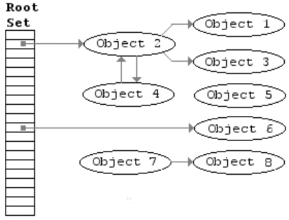

Adresování a správa paměti - Garbage collecting, Reference/ukazatele, Struktura paměti programu
===

První věcí, kterou se hodí zmínit, je, že zde budeme brát v potaz fungování paměti, procesu a programu pouze v Linuxových operačních systémech. Kdyby někoho zajímalo, jaká je konkrétní implementace ve Vidlích, může si to nastudovat sám. Nicméně většina stěžejních konceptů by měla být pro všechny konvenční operační systémy stejná.                 
V této otázce se dostaneme hodně do hloubky. Proč? Nu, aby jsem vám dal dostatek prostoru a především, abyste si dovedli všechny koncepty hezky spojit.             
Začneme třeba u paměti, ta tak nějak prostupuje všemi třemi podtématy otázky .. a vlastně ji má otázka i ve jméně. Co to ta paměť vlastně je? Když mluvíme o paměti počítače, zpravidla máme na mysli operační pamět, tedy RAM (Random Access Memory). Existuje samozřejmě třeba i pamět cache, ale té se zde věnovat nebudeme. Na to je samostatná extra sekce.                    
Dobře, k čemu nám operační pamět vlastně je? Když počítač pracuje s programem, jeho instrukce musí být někde uložené tak, aby si je mohl procesor postupně brát a vykonávat. Když pomineme existenci právě té cache paměti, tyto instrukce bere právě z paměti RAM. Proč ne třeba z disku? No, protože čtení disku, byť třeba z toho nejrychlejšího SSD, je asi tisíckrát pomalejší, než čtení z operační paměti. To si ostatně ještě povíme, až přijde řeč na paměť swap. V operační paměti jsou tedy uloženy všechny informace o právě běžících programech. Procesor k nim přistupuje pomocí adres, o těch si také povyprávíme více do hloubky.               


Uděláme si takový rychlý vhled do hárdwéru. Na obrázku výše vidíte tři sběrnice. Podobně to vypadá i právě v našem počítači. Jedna je datová, ta mívá dnes zpravidla třeba 64 bitů, možná více, nejsem expert přes procesory. Druhá je adresová sběrnice. Ta se využívá právě k našemu přístupu k operační paměti. Typická velikost dnes bývá 48 bitů. Na této sběrnici se dnes také nachází jedna velmi užitečná komponenta, MMU (Memory Management Unit). Ta bude velmi důležitá záhy. Pro zajímavost, existují operační systému, které ji neumí využít. To může způsobovat určitě problémy, těmi se zde ale nebudeme zabývat. Poslední sběrnice je kontrolní a rovnou vám povím, že hardware umím tak maximálně rozflákat, takže vám jen stěží vysvětlím, k čemu konkrétně slouží, nicméně ji tam máme také a nesmíme na ni zapomínat.                       
Dobrá, teď již víme, že každá buňka v paměti má svou adresu. Co je jedna buňka? Byte, tedy 8 bitů. To je ale spíš taková HW buňka, náš počítač si s pamětí zachází tak trochu po svém, jak si brzy ukážeme. Jak taková adresa vypadá? No, třeba takto: *0xFFA3*. Přesně tak, adresy v paměti se zapisují v šestnáctkové soustavě (pokud neumíte šestnáctkovou soustavy ve čtvrtém ročníku, upřímnou soustrast). Je to nejintuitivnější zápis a rychle si na něj zvyknete.               


Tak, problematika, kterou si teď představíme, není úplně triviální a ani já v tom nejsem žádný expert. Pokud by vás to zajímalo více do hloubky, videa níže to dovedou efektivně vysvětlit. Budeme mluvit o konceptu virtuální paměti a stránkování. Nejdříve trocha historie. Ve starších operačních systémech a strojích nic jako virtuální pamět neexistovalo. Programy zkrátka seděly někde v paměti a využívaly ke svému běhu fyzické adresy. To mohlo způsobit např. to, že jste si přepsali jiný program, nebo rovnou něco, co má v paměti uložený kernel. Typicky třeba na vyšších adresách. To logicky úplně nechcete. Tento přístup také způsoboval spoustu jiných problémů. Co mu ale jistě nemůžeme odepřít je, že byl jednoduchý a rychlý.                 
S rostoucími požadavky programů na pamět a z hlediska bezpečnosti bylo rozhodně potřeba vymyslet něco lepšího. Tím lepším je virtuální pamět. Jednoduše řečeno, každý proces má pocit, jako by měl k dispozici sám pro sebe celé adresové pole, o které si zažádá. Pokud je potřeba dostat data z nějaké adresy, nevyužívají se adresy fyzické (tedy ty, na kterých v operační paměti skutečně leží daná informace), ale adresy virtuální. Virtuální adresy zde libovolně mapovat na fyzické. Toho se využívá např. u sdílených knihoven, kdy více programů má stránu namapaovanou na to jedno místo v paměti, ve kterém leží.                      
Jak to ale konkrétně funguje? Začneme od hardwaru. Abychom vůbec mohli využít virtuální paměť, potřebujeme hardwarovou podporu, konkrétně našeho kamaráda MMU. Jak již bylo řečeno, ta se nachází na adresové sběrnici. Určitý počet bitů nechává volně projít, zbytek překládá. Co to znamená? Mějme běžnou velikost stránky v paměti, 4KiB. Stránku můžeme chápat jako blok adres pevně dané velikosti. Paměť je tak rozdělena do konečného počtu stejně velkých stránek. Především z praktických důvodů, různě velké stránky by bylo složité implementovat. Velikost stránky si může určit operační systém. Vybírá je z možností nabízených danou architekturou procesoru. V konkrétním případě velikosti stránku 4KiB se to v MMU odrazí tak, že prvních 12 bitů jím volně prochází, tedy bez překladu. Zbylé bity jsou přeloženy.                     
Jak takový překlad probíhá a co to vlastně znamená? Každý proces má svou tabulku stránek. To je nějaká struktura, kterou má pod svou správou kernel. Tato tabulka má spoustu řádků, které nazýváme PTE (Page Table Entry). Ty, mimo jiné, obsahují číslo stránky a na jaké místo ve fyzické paměti je namapována. Tímto způsobem mohou například dva procesy sdílet knihovnu. Oba mají nějakou stránku namapovanou na stejné místo ve fyzické paměti. MMU tedy pomocí tohoto mapování přeloží stránku na adresu ve fyzické paměti (pro získání celé adresy musí samozřejmě ještě přidat offset, který prošel MMU bez překladu). Jen pro zvědavce, tabulka stránek umí být hodně veliká, třeba 4MB pro jeden proces. To by při počtu procesů u konvenčních operačních systémů bylo naprosto neúnosné, proto je třeba to řešit. Typickým řešením je rozdělit tuto tabulku do několika menších, které operační systém donahrává postupně.              
V tabulce stránek je ještě jedna důležitá informace. Zda je záznam platný. Co znamená, že záznam je platný, nebo neplatný? Nu, platný záznam již byl namapován, tedy daná stránka se již nachází v paměti. Neplatný záznam zatím namapován nebyl. Dostane-li MMU k mapování neplatný záznam, lekne se a zahlásí chybu, tzv. page fault. Operační systém chybu odchytí, podívá se na ni a zpravidla domapuje danou stránku. Pak zavolá opět instrukci, která předtím selhala, a může se pokračovat dál. Může se také stát, nebudeme si vysvětlovat jak, že operační systém zjistí, že si chce proces sáhnout někam, kde nemá co dělat. V takovém připadě je proces nemilosrdně zabit.            
Poslední věc, kterou si zmíníme, než se dostaneme opravdu k paměti procesu, je pamět swap. Může se nám stát, že nám operační paměť zkrátka dojde. Co potom? Moderní operační systémy to řeší pamětí swap. V Unixových operačních systémech je to typicky oddělená partice na disku o velikosti např. poloviční velikosti RAM. V případě potřeby zde může operační systém odkládat stránky, které se do paměti již nevejdou. Má to však jeden háček a to je také důvod, proč bychom se měli snažit aktivnímu využití paměti swap spíše předejít. Přístup ke swapu je extrémně pomalý.            
Dojde-li místo i v paměti swap, systém se může rozhodnout, jak problém řešit. Nejjednodušší řešení je prostě zabít proces s největší paměťovou stopou. To nemusí vždycky fungovat, ale tím se nemusíme trápit. Z osobních zkušeností mi takhle jednou Linux na virtuálce zabil Intellij Idea. Žádná ztráta dat se nekonala, ale pozor na to.            


Tak, paměť procesu. Povíme si jen to, co by se vám mohlo opravdu hodit k maturitě. Konkrétní implementace záleží na konkrétním operačním systému a architektuře. Na obrázku výše je pro referenci ukázáno, jak asi vypadá paměť procesu v Linuxu.           
Je rozdělena do několika segmentů. Nás bude zajímat především segment Stack a Heap.         
Stack, neboli zásobník, je velmi specifická datová struktura, která je zde implementována především v podobě call-stacku. Zásobník je tzv. LIFO (Last In First Out). Můžete si ho představit jako štos knih nebo talířů. Vždy můžete vzít jen ten ze shora, abyste se mohli dostat k těm níže. Ačkoliv zde to není zrovna nejlepší analogie, v případě proměnných operační systém tento koncept tak trochu porušuje. My se ale nebudeme zabývat zásobníkem na tak nízké úrovni.             
Stačí nám vědět, že každá metoda a funkce, která se zavolá, je společně se jejími argumenty a lokálními proměnnými vložena na vrchol zásobníku. Dokud tato metoda neukončí svůj běh, metody spuštěné před ní také nedoběhnou. Tohoto principu lze velmi pěkně vužít např. při rekurzi.          
Zásobník může mít omezenou velikost. Zavoláme-li tolik funkcí/metod, že náš stack přeteče, program nám jednoduše spadne.                
Základní datové typy, jsou-li deklarované jako lokální proměnné, se zpravidla ukládají právě na zásobník. Konkrétně třeba int, char, long, bool, ... Hlavně tady prosím vás nezmiňujte string, to byste si pěkně zavařili. Ne, že by nemohl existovat string na zásobníku, ale ve většině jazyků se ukládá jinde. Nicméně, taková perlička, třeba C++ dovede uložit i objekt na Stack, ono tomu nic vyloženě nebrání. Nicméně důležité je si uvědomit, že takový objekt by po konci funkce přestal existovat, protože by byl vytvořen jako lokální proměnná.                   
Druhým místem, kde se mohou proměnné vytvořené za běhu programu nacházet, je heap, halda. Zklamu vás, s haldou jako datovou strukturou má pramálo společného. Je to takový sklad dat. Nachází se zde referenční datové typy. Co to znamená? Znamená to, že v zásobníku je uložena pouze reference na tento object. Ten samotný je uložen právě na haldě.                    
Chceme-li něco uložit na haldu, musíme si to nejdříve alokovat. Operační systém nám předá ukazatel na místo, které jsme si takto zabrali a dále se o to nestará. To může být problém, pokud po sobě alokované místo patřičně neuklidíme, tedy nedealokujeme. To jest, neřekneme operačnímu systému, že toto místo je opět volné. Mohou tak vznikat různá přetečení paměti a můžeme mít spoustu nechtěných problémů. V moderních jazycích se nám o toto stará Garbage collector, o kterém si povíme záhy.            
Globální proměnné se nachází na speciálním místě. Tomuto místu říkáme datový nebo BSS segment. Rozdíl je, že v BSS jsou neinicializované proměnné. Jejich velikost musí být známa při kompilaci.             
Zde jsem pro vás připravil příklad jednoduchého programu v jazyce C. Je popsaný tak, aby bylo vidět, co je uložené na haldě, v datovém segmentu či na zásobníku.

```C
#include <stdio.h>
#include <stdlib.h>

int global_variable = 25; // Bude vytvorena v datovem segmentu, je to globalni promenna

int sum(int a, int b) // Obe promenne budou existovat pouze tak dlouho, nez funkce dobehne, jsou tedy lokalni a budou ulozeny na stacku
{     
    return a + b;
}

int main()
{
    int local_variable = 10; // Bude vytvoren na zasobniku, je to lokalni promenna
    
    int *p = malloc(sizeof(int)); // Pointer na int bude vytvoren na stacku, je to lokalni promenna.
                                  // Malloc alokuje presne misto na jeden int na halde.
    
    *p = 30;    // Dereferencujeme pointer, int na halde bude nyni drzet hodnotu 30
    
    int sum_of_two_integers = sum(30, 20); // Zde se program zastavi, dokud nedobehne funkce sum(a,b)
                                           // Na call stack pribyla nova metoda, takze je potreba ji vykonat jako dalsi -> je na vrchu call stacku
    
    printf("Globalni promenna: %d\n", global_variable);
    printf("Lokalni promenna: %d\n", local_variable);
    printf("Promenna na halde: %d\n", *p);
    printf("Vysledek sumy: %d\n", sum_of_two_integers);

    return 0;
}
```


Měli bychom si vysvětlit rozdíl mezi pass-by-value a pass-by-reference. Když má naše funkce nějaké parametry, muhou do funkce vstupovat dvěma způsoby. Buď jako jejich hodnota, funkce tedy využívá pouze hodnotu vstupního parametru. Pokud ho ve funkci změníme, nezmění se jeho hodnota nikde jinde. Druhým způsobem je pass-by-reference. Do metody tedy v podstatě vstupuje pointer na proměnnou parametru. Když tedy v metodě změníme tuto proměnnou, změníme i její hodnotu všude jinde v programu. 
Nebo alespoň tak si to můžeme představit pro zjednodušení. V C++ je ale rozdíl mezi pointerem a referencí. Reference je pouze takový alias na náš objekt. Jak jsou reference implementovány v kompileru je pouze na implementaci, dokud dodržují pravidla pro referenci. Můžeme do metody poslat i pointer na objekt. Ten se chová malinko jinak.             
Co to vlastně ten pointer je? Pointer je koncept, který známe z třeba z jazyka C. Pointer ukládá nikoliv hodnotu proměnné, ale hodnotu její adresy na haldě, nebo zásobníku. Změníme-li hodnotu v objektu, odrazí se to na všech pointerech, které na ni ukazují.               
Ukážeme si teď, jak vypadá pass by value:

```C++
#include <iostream>

using namespace std;

void pass_by_value(int a){
    a = a + 1;
    cout << "This is value of 'a' inside the function: " << a << endl;
}

int main(){
    int a = 10;

    pass_by_value(a);

    cout << "This is value of 'a' after calling the function: " << a << endl;

    return 0;
}
```

Jak můžeme vidět, když jsme změnili proměnnou a ve funkci při použití pass_by_value, hodnota proměnné se nezměnila nikde jinde. Je to proto, že do fce jsme poslali jen a pouze hodnotu naší proměnné. Parametr fce už nemá s naší proměnnou nic společného.                    
Na druhou stranu, když chceme využít pass_by_reference:

```C++
#include <iostream>

using namespace std;

void pass_by_reference(int &a){
    a = a + 1;
    cout << "This is value of 'a' inside the function: " << a << endl;
}

int main(){
    int a = 10;

    pass_by_reference(a);

    cout << "This is value of 'a' after calling the function: " << a << endl;

    return 0;
}
```

Stačilo přidat ampersand před náš parametr a program se hned chová jinak. Nyní se naše proměnná změní. Je to proto, že posíláme do fce referenci na naši proměnnou. To samé bychom mohli udělat také pomocí pointeru:       

```C++
#include <iostream>

using namespace std;

void pass_by_pointer(int *a){
    *a = *a + 1;
    cout << "This is value of 'a' inside the function: " << *a << endl;
}

int main(){
    int a = 10;

    pass_by_pointer(&a);

    cout << "This is value of 'a' after calling the function: " << a << endl;

    return 0;
}
```

A tradá, funguje to stejně jako s referencí. Jen jsme museli přidat pár hvězdiček a místo proměnné do fce zasíláme její adresu (ampersand je tzv. address of operátor. Neptejte se mě, proč ho využívají i u pass by reference. Tam tento operátor takto nefunguje). Jaký je tedy rozdíl? Reference je takový syntaktický cukřík ke const pointeru, tedy k ukazateli, kterému nesmíme měnit hodnotu. To neznamená, že bychom nemohli změnit objekt, na který ukazuje. Nemůžeme ale změnit, kam pointer ukazuje. Názorný příklad:

```C++
#include <iostream>

using namespace std;

void pass_by_reference(int &a){
    a = a + 1;
    int b = 12;
    a = b;
    b++;
    cout << "This is value of 'a' inside the function: " << a << endl;
    cout << "This is value of 'b' inside the function: " << b << endl;
}

int main(){
    int a = 10;

    pass_by_reference(a);

    cout << "This is value of 'a' after calling the function: " << a << endl;

    return 0;
}
```

Jak můžeme vidět, a = b změnilo pouze hodnotu 'a', nicméně reference stále ukazuje na to samé místo v paměti, proto 'b++' nezměnilo 'a'.                    
Referenci jsou ale věcí především C++. Třeba Java je striktně pass by value. Jak tedy předáváme objekt? Předáváme hodnotu pointeru na objekt. Můžeme pak v metodě měnit objekt, ale když změníme hodnotu pointeru v metodě, třeba na jiný objekt, jinde v programu se to neodrazí. Takhle by to vypadalo: 

```Java
public class Main{

    public static void tryToModify(Modifiable m){
        m.setN(10);
    }

    public static void main(String[] args) {
        Modifiable mnm = new Modifiable(0);
        System.out.println(mnm.getN());
        tryToModify(mnm);
        System.out.println(mnm.getN());
    }
}

public class Modifiable {
    private int n;
    
   public Modifiable(int n){
        this.n = n;
   }

   public void setN(int n) {
       this.n = n;
   }
   public int getN() {
       return n;
   }
}
```

Posledním tématem bude garbage collection. Je to velmi užitečná utilita implementovaná do moderních programovacích jazyků. Periodicky se spouští a čistí za nás haldu. Nemusíme se tedy starat o dealokaci objektů, dělá to za nás garbage collector. Pokud již v našem kódu nejsou na object na haldě žádné reference, tento objekt uklidí.            
Existuj9 objekty, na které bude existovat reference po celou dobu běhu programu, nebo přinejmenším velmi dlouho. Takové objekty by bylo zbytečné kontrolovat při každém spuštění sběratele odpadu. Pokud tedy objekt přežije více sběrů, je kontrolován méně, protože garbage collector předpokládá, že tento objekt jen tak nezmizí. Jak tento mechanismus funguje konkrétně, to záleží na implementaci.                   



Materiály
---

Chris Kanich - Introduction to Processes in Linux - https://iv.ggtyler.dev/watch?v=WkuKhLYtUHw          
MIT OpenCourseWare - Basics of Virtual Memory - https://invidious.perennialte.ch/watch?v=8yO2FBBfaB0            
Tech With Nikola - But, what is Virtual Memory - https://invidious.nerdvpn.de/watch?v=A9WLYbE0p-I               
The Linux Foundation - Introduction to Memory Management in Linux - https://invidious.perennialte.ch/watch?v=7aONIVSXiJ8            
Computerphile - What's virtual memory? - https://invidious.jing.rocks/watch?v=5lFnKYCZT5o           
University Of Waterloo - Virtual Memory - https://student.cs.uwaterloo.ca/~cs350/F19/notes/virtualmemory-1up.pdf            

Coding With John - Java's Garbage Collection Explained - https://inv.nadeko.net/watch?v=Mlbyft_MFYM                 
Computerphile - Garbage Collection (Mark & Sweep) - https://invidious.perennialte.ch/watch?v=c32zXYAK7CI            

Alex Hyett - Stack vs Heap Memory - https://inv.nadeko.net/5OJRqkYbK-4?t=1      
Mycodeschool - Pointers and dynamic memory - https://iv.ggtyler.dev/watch?v=_8-ht2AKyH4             

Bro Code - C pointers explained - https://iv.ggtyler.dev/watch?v=DplxIq0mc_Y            
Low Level - You will never ask about pointers again after watching this video - https://iv.ggtyler.dev/watch?v=2ybLD6_2gKM          

Coding with John - Java is Always pass by value. Here's why - https://iv.ggtyler.dev/watch?v=-5NC5_sI-vQ            
theteachr - Demystifiyng Pointers - Pass by Value vs. Pass by Reference - https://iv.ggtyler.dev/watch?v=qz_iz_PLorc            
Bro Code - C++ pass by value vs pass by reference - https://iv.ggtyler.dev/watch?v=ao0I1ViVV6U                  
Caleb Curry - C++ Programming Tutorial 67 Pass By Reference and Pass By Value - https://iv.ggtyler.dev/watch?v=FXzpFn8LJUI