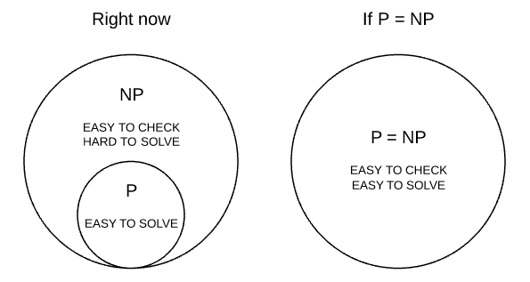

Algoritmizace - Rekurze, Brute Force, Heuristiky, Nedeterministické algoritmy
===

Povídání
---

Jdeme se podívat na další zajímavou otázku o algoritmizaci. Tentokrát si ale dáme pohov od grafů a jejich prohledávání a čekají nás trochu obecnější algoritmy, nebo spíše metody jejich tvoření.       
Začneme hned u rekurze, se kterou jsme se již setkali v minulé otázce, konkrétně třeba u DFS a třídění sléváním. Když to povím naprosto bez omáčky okolo, rekurze stojí na tom, že nějaká metoda či fce volá sama sebe. Jo, to je opravdu všechno, čekali jste něco komplexnějšího?             
Nicméně právě tento tríček nám dovoluje vytvářet velmi zajímavé algoritmy. Já jsem v ukázkách uvedl jen velmi jednoduchý algoritmus na rekurzivní umocňování, ale pro demonstraci nám postačí.          
Každá rekurze potřebuje nějakou podmínku, pod kterou se zastaví a místo dalšího volání sama sebe, fce vrátí konkrétní hodnotu.              
Z první otázky víme, že existuje zásobník volání metod (Call Stack). Každé další rekurzivní volání je přidání na call stack a shora vykonáváno. Takže když poslední metoda vrátí jedničku, zpracuje ji metoda, která ji volala, a její výsledek pak zpracuje metoda, která ji zavolala a tak dále a tak dále, než se dostaneme k metodě, která nebyla zavolána rekurzivně, ale byla zavolána někde v hlavním kódu a ta vrátí konečný výsledek.              
Rekurzivní algoritmy často mívají specifické vlastnosti nebo nám dovedou zjednodušit či zrychlit řešení problému. Jednou evidentní nevýhodou je velká spotřeba paměti. Každé další volání je přidáno na vrchol zásobníku. Pokud se opravdu hodně zanoříme, může nám také jednoduše přetéct (Stack Overflow).            
Takhle může vypadat jednoduché rekurzivní umocňování v Pythonu:

```Python
# Vytvorime funkci power(x, n), ktera vola sama sebe, aby dosahla umocneni cisla
def power(x: int, n: int) -> int:
    if n == 0:  # Kazda rekurze potrebuje podminku, pri ktere uz nespousti sama sebe, ale vrati konkretni hodnotu
        return 1    # Cokoliv na nultou je jedna, takze muzeme smele vratit jednicku
    
    return x * power(x, n-1)    # Fce vraci cislo x vynasobene o jedna nizsi mocninou cisla x

# Vypiseme vysledky
print(power(3, 4))
```

Takhle v Javě:

```Java
public class Main{

    public static int on_power(int num, int exp){
        if(exp <= 0){
            return 1;
        }
        return num * on_power(num, exp-1);
    }

    public static void main(String[] args) {
        int i = 5;
        System.out.println(on_power(i, 5));
    }
}
```

A takhle by to mohlo vypadat v C++:

```C++
#include <iostream>

using namespace std;

int on_pow(int num, int exp){
    if(exp <= 0){
        return 1;
    }
    return num * on_pow(num, exp-1);
}

int main(){
    int i = 13;

    cout << on_pow(i, 3) << endl;

    return 0;
}
```


Podíváme se na jednoduchý problém. Potřebujeme zjistit heslo od zámku sousedovi garáže. Neptejte se mě proč, prostě to potřebuji vědět. Je několik možností, jak se s takovým problémem vypořádat.          


Jedním z nich, který asi napadne nás všechny, je, že člověk zkrátka vyzkouší všechny kombinace, jedna přeci musí fungovat. Tomuto přístupu se říká Brute Force, hrubá síla, mělo by to být docela intuitivní pojmenování.           
V Pythonu takový algoritmus může vypadat třeba takhle:

```Python
# Not the best example, since the method brute_force() is specifically designed for the case of four digits
# But should be enough to demonstrate the concept

correct_combination = [4, 1, 1, 4]     # We define the correct comobination  

# The method brute force tries every combination. Its time complexity grows exponentially with the number of digits
def brute_force():
    for i in range(0, 10):
        for j in range(0, 10):
            for k in range(0, 10):
                for l in range(0, 10):
                    attempt = [i, j, k, l]
                    if(attempt == correct_combination): # Correct combination found
                        return attempt

# Print out the results 
print(brute_force())
```

No, ačkoliv tento přístup naprosto bez pochyby funguje, soused má na zámku šestimístný kód. Než to vyzkouším všechno, přijedou benga a mám po prdeli.           
V tomto konkrétním případě by bylo potřeba vyzkoušet 10^6 kombinací zámku. Máme šest pozic, na každé může být jedno z deseti čísel, čísla se mohou opakovat, to je variace s opakováním, takže n^k různých kombinací.           
Všechny možné kombinace nazýváme stavovým prostorem problému. Jo, když si na internetu najdete definici stavového prostoru, vyjede vám něco neskutečně složitého a zvláštního a budete tomu prd rozumět. Já jsem v praxi vždy nazýval množinu kombinací, ze kterých vybíráme řešení problému, stavovým prostorem. Stavový prostor může být třeba i graf. Představme si třeba problém osmi dam. Každý jeden stav na desce je uzel grafu. Tento stavový prostor můžeme prohledávat třeba pomocí DFS. Tedy vždy, když se dostaneme do chvíle, kdy již nemůžeme položit další dámu, aniž by se ohrožovaly, vrátíme se zpátky a zkusíme to jinak.                      
V případě sousedova zámku má stavový prostor velikost 10^6 prvků. Nu, velmi často se setkáváme s tím, že stavový prostor je monožina permutací nějakého pole. Důležitým poznatkem je, že stavový prostor dovede být opravdu hodně velký.         
Nuže, hrubá síla tedy funguje, nicméně využití hrubé síly na stavový prostor větší než pár tisíc prvků, možná i méně, je nesmírně pomalé a pro ještě větší prostory dokonce v podstatě nemožné. Útěchou nám může být snad jen to, že takový přístup opravdu pokaždé najde to nejlepší řešení. Pokud nějaké řešení existuje samozřejmě.           



Dobře, hrubá síla není ideální. Jak se ale s takovým problémem vypořádat jinak? Existují způsoby a my se na ně jdeme podívat.                   
První věcí, kterou by se hodilo osvětlit, je P vs NP problematika. Když to velmi zjednoduším, extistují dva typy problémů. A nemusíme se nutně bavit jen o těch, které se objevují v počítačové vědě. Tyto typy problémů se vyskytují ve všech aspektech našeho života. Od sudoku, šachů až po skládání proteinů.               
Prvním typem je typ P. P jako polynomiální. To jsou problémy, které jsme schopni vyřešit v polynomiálním čase nějakým deterministickým algoritmem.           
Uděláme si rychlou odbočku, abychom si vysvětlili, co to znamená deterministický a nedeterministický. Když budu parafrázovat Wikipedii, determinismus je filosofické přesvědčení, že každá událost nebo stav věcí je důsledkem předchozích událostí na principu kauzality a pevně daných zákonitosí. Co to ale znamená pro nás jako pro programátory? Že deterministické algoritmy pracují vždy naprosto stejně, ze stejného vstupu vždy vyjde stejný výstup. Když to ještě více zobecníme, deterministický algoritmus se dá zapsat jako nějaký konečný deterministický automat, tedy takový automat, který má v každou chvíli právě jeden stav. Nicméně k maturitě teorii automatů snad umět nemusíte.          
Příklady deterministických algoritmů mohou být řadící algoritmy. Prvky listu vždy seřadí stejným způsobem, na výstupu bude seřazené pole.           
Naproti tomu nedeterministický algoritmus může ze stejného vstupu vytvořit různé výstupy. Hezkým příkladem je metoda Monte Carlo. Řešíme-li problém touto metodou, náhodně vybereme ze stavového prostoru několik možností a z nich vybereme tu nejlepší, popř. se spokojíme s tím, že jsme zrovna správnou odpověď nevybrali. Takový algoritmus pokaždé vydá jiné výsledky, je nedeterministický, nelze odhadnout jeho výstup. Kdybychom si to opět převedli to teorie počítačových automatů, nedeterministický automat je takový automat, který se může v jednu chvíli nacházet v několika stavech a na konci vybere ten, který vyhovuje jeho koncovému stavu, nebo žádný.                

```Python
import random

correct_combination = [4, 1, 1, 4]

def monte_carlo(num_of_tries):
    while num_of_tries > 0:
        num_of_tries -= 1
        combination = [random.randint(0, 9), random.randint(0, 9), random.randint(0, 9), random.randint(0, 9)]
        if combination == correct_combination:
            return "Success"
    return "Failure"


print(monte_carlo(5))
```

Dobrá, když jsme si teď osvětlili rozdíl mezi deterministikým a nedeterministickým algoritmem, můžeme se vráti k P vs NP problematice. Ještě jednou, P problém je tedy takový problém, který se dá vyřešit deterministickým strojem, algoritmem, v polynomiálním čase. Polynom je výraz např. tomto tvaru **n^7 + 4n^6 + 2n^4 + 20n + 3**. Toto by mohla být složitost nějakého algoritmu. Nicméně vypadá-li složitost takto, zpravidla se bere v potaz pouze nejvyšší mocnina, která má největší dopad na výsledek. Složitost takového algoritmu by tedy byla O(n^7). Jakýkoliv problém, který má podobnou složitost, tedy polynominální, x na něco, lze označit jako P problém.               
P problémy umíme zpravidla řešit rychle, patří mezi ně třeba umocňování, zjištování, zda je číslo prvočíslo atd. Samozřejmě existují i P problémy se složitostí tak zlou, že ani ty nejsou řešitelné v rozumném čase, třeba n^10000000.                     
Obecně se předpokládá, že P problémy jsou podmnožinou NP problémů. NP problémy jsou takové problémy, které umíme v polynominálním čase ověřit, nicméne už je v něm neumíme deterministicky řešit. Krásným příkladem je třeba sudoku. Počítač umí velmi rychle řešit sudoku o velikosti 3x3 nebo 5x5. Ale co teprve 10000x10000? To už nebude taková hračka. Nicméně zkotrolovat takové sudoku bude jedoduché, prostě spočteme, zda má každý sloupec a řádek stejný součet, to je lineární složitost, takže to bude hned.                    
Takové problémy potřebují speciálně upravené algoritmy, které se snaží je vyřešit v nějakém rozumném čase, nebo je nevyřeší vůbec. Využívané algoritmy bývají také zpravidla nedeterministické a idálně využívají nějakou heuristiku. O těch si povíme za chvíli. Obecně ale lze říci, že nejsme schopni obzvlášť efektivně řešit NP problémy pro větší počet prvků. Takové běžná složitost NP problému může být třeba 2^n nebo n!.               
Tak pro zajímavost, kdyby jste našli způsob, jak velmi efektivně řešit libovolně velké sudoku v polynominálním čase, pravděpodobně byste zároveň našli lék na rakovinu, protože skládání proteinů je také NP problém. Hodně štěstí!                 
A další zajímavost, kdyby se vám to opravdu povedlo a chtěli jste to oznámit široké veřejnosti, pravěpodobně by vás dřív odstřelil nějaký najatý agent, protože nejmodernější šifry jsou postavené právě na tom, že NP problémy nelze jednoduše řešit. Takže šifrování by se pak efektivně stalo zbytečné. Hezké že?                
A poslední zajímavost, než se podíváme na heuristiky. Rozhodování o tom, jaký tah v šachách, je v daný moment nejlepší, je tak složitý problém, že nepatří ani do NP, ale do vrstvy ještě o řád výš.                

Když se vrátím k naší analogii se sousedem, kterému rozhodně nechci ukrást sekačku nebo tak něco, zjistili jsme, že hrubá síla není nejlepší způsob, jak prolomit kód na jeho zámku. Co když ale znám nějaký trik? Vím, že soused je autista a potřebuje mít vše symetrické. To znamená, že kód na jeho zámku by měl být také symetrický. A hle, najednou jsem složitost problému snížil z 10^6 na 10^3. To už je značně lepší. To bych dokonce tou hrubou silou mohl i zvládnout.              
Využil jsem něco, čemu se říká heuristika. Heuristika je nějaký předpoklad k problému, který nám může pomoci ho vyřešit. Já vím, že soused je blbec a mohou toho zneužít. Za chvíli si ukážeme trochu reálnější případ, konkrétně algoritmus A*. To je jakási takási úprava Dijkstrova algoritmy pro nalezení nejkratší cesty v grafu. A právě tato chytrá úprava využívá heuristiku ke zrychlení nalezení nejkratší cesty.            


Ačkoliv si A* nebudeme programovat, můžeme si ho zkusit alespoň zhruba odvodit. Víme, že Dijkstrův algrotimus prohledává celý graf postupně. Kdybychom chtěli najít vzdálenost mezi dvěma konkrétními body, algoritmus bychom museli ukončit, jakmile by se dostal k druhému bodu. V tuto chvíli ale velmi pravděpodobně také prohledal valnou většinu našeho grafu. To je pomalé a zbytečné.               
Jak bychom takový problém mohli vyřešit? Nu, představme si, že se chceme na mapě dostat z bodu A do bodu B. Nechceme přeci jet po cestě, která vede na druhou stranu. Musíme vymyslet nějakou heuristiku, pomocí které se bude moci algoritmus řídit a postupovat plus minus správným směrem. Na mapě můžeme zvolit třeba vzdálenost vzdušnou čarou. Algoritmus se tedy nebude řídit jen hodnotami hran, ale také jakousi přidanou hodnotou každého uzlu. Tato přidaná hodnota bude větší, bude-li úplně špatným směrem, a menší, když se budeme přibližovat k cíli.                
Algoritmus se tedy bude řídit naší heuristikou. Zároveň také bude jen tak dobrý, jak dobrá je naše heuristika. Jak si ale můžeme být jisti, že takový algoritmus opravdu našel tu nejkratší cestu? Nu, v realitě využívá A* něco, co se nazývá potenciálová redukce. Pokud vás to zajímá, můžete se podívat do Průvodce labyrintem algorimů nebo na nějaké šikovné video, já se tentokrát zdržím vysvětlování.

Materiály
---

Martin Mareš a Tomáš Valla - Průvodce labyrintem algoritmů - https://pruvodce.ucw.cz/static/pruvodce.pdf            
- **Kapitola 6.5** Nejkratší cesty - Heuristiky a potenciálová redukce

Bro Code - Learn Recursion in 8 minutes -             

Nikhill Lohia - Brute Force algorhitms with real life examples -

Complexity Explorer - Indroduction to Computation Theory: Heiristics -            
Anish Krishnan - A* Search and Heuristic Intution in 2 minutes -   
Polylog - The hidden beaty of the A* algorithm -                     
Computerphile - Non-Determinitic Automata -                 
TutorialsPoint - Non Determinitic Algorithms -              
Hackerdashery - P vs. NP and the Computational Complexity Zoo -             