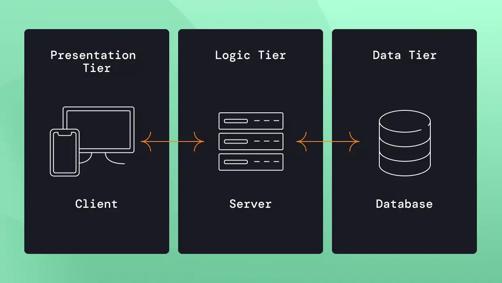
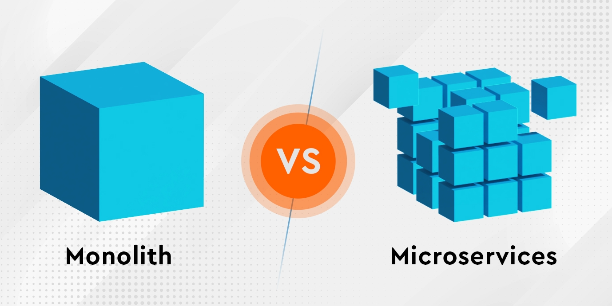
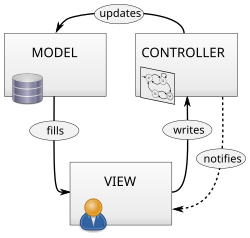

Architectural design patterns - MVC, Multitier, Monolithic, P2P, Client/Server
===

Povídání
---

Architektonické návrhové vzory. Podobně jako u klasických návrhových vzorů, někdo si všiml, že řeší nějaký problém opakovaně stejným způsobem. Tak pro něj navrhl nějaký vzor. Zde je ale jeden fundamentální rozdíl. Tyto vzory se aplikují na celou naši aplikaci, její architekturu. Nejlépe si to ukážeme na konkrétních příkladech.                    
Nejlepší příklad je Multitier. Rozvrhneme naši aplikaci do několika vrstev, třeba tří. Vrchní vrstva se bude starat o interface pro uživatele. Prostřední vrstva pak o nějaký byznys lodžik. To jsou nějaké konkrétní kalkulace, co se stane při kliknutí na tlačítko atd. Spodní vrstva se stará o sběr dat třeba z databáze. Takovému architektonickému vzoru by se říkalo Three-tier, má 3 vrstvy. Naše aplikace je tak mnohem flexibilnější, jednotlivé její části lze znovu použít a lze se v ní lépe orientovat.    

To nemůžeme říct, vytváříme-li naší aplikaci monoliticky. To znamená, že aplikace není nijak rozdělena, všechny její části mohou mít různé závislosti s ostatními částmi. Jednoduše řečeno, děláme aplikaci specificky a jenom pro náš jeden účel a moc se nestaráme o to, jak bude vypadat její kód a zda budeme moci nějaké její části využít i v jiných projektech. Zpravidla je tento přístup tak trochu fujtabl, ačkoliv třeba já jsem tak dělal většinu projektů ... Existují ale i případy, kdy je tento vzor docela běžný. Třeba při psaní kernelu operačního systému, tam se s nějakým znovupoužitím moc nepočítá.         
Kernel lze ale také napsat v jiném návrhovém vzoru, pomocí micro services. V tomto vzoru je napsaný třeba Minix. Znamená to, že naši aplikaci rozdělíme do několika samostatných částí, každá bude mít svůj vlastní úděl. Tohoto vzoru se také hojně využívá, chceme-li vytvořit velmi stabilní aplikaci. Spadne-li totiž jen jedna ze serviců, zpravidla to neznamená pád naší aplikace. To je trochu opak k monolitickému přístupu, kde nějaká fatální chyba často znamená, že naše aplikace jde do hajzlu.           

Existují ale i trochu specializovanější vzory, třeba Client/Server. V takovém vzoru bývají třeba aplikace pro komunikaci s databází, spousta webových aplikací atd. Máme tady naši aplikaci, klienta, a ten komunikuje s nějakým serverem, na kterém je typicky nějaká služba, třeba databáze.              
Další specifický vzor je P2P (Peer-to-peer). Tento vzor předpokládá, že máme několik zařízení, které komunikují pomocí stejného protokolu mezi sebou. Každé zařízení je jeden peer, proto peer-to-peer.             

Otázka zmiňuje architekturu MVC (Model-View-Controller). Já jsem v tomto vzoru nikdy nic nenapsal. Nicméně funguje na něm třeba Ruby-on-rails a různé další frameworky. Dám vám semka obrázek, ten vám nejlépe vysvětlí, jak tato architektura zhruba funguje. Důležité je také poznamenat, že existují různé adaptace této architektury.

Materiály
---