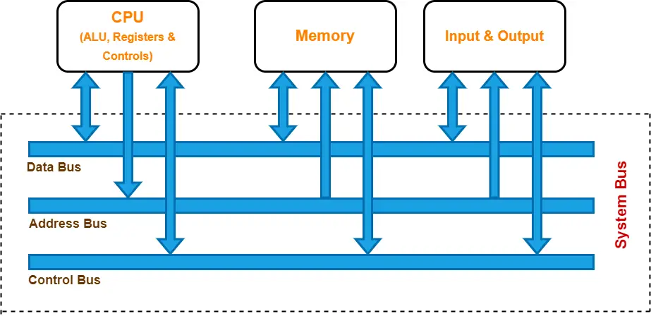

Adresování a správa paměti - Garbage collecting, Reference/ukazatele, Struktura paměti programu
===

Povídání
---

První věcí, kterou se hodí zmínit, je, že zde budeme brát v potaz fungování paměti, procesu a programu pouze v Linuxových operačních systémech. Kdyby někoho zajímalo, jaká je konkrétní implementace ve Vidlích, může si to nastudovat sám. Nicméně většina stěžejních konceptů by měla být pro všechny konvenční operační systémy stejná.                 
V této otázce se dostaneme hodně do hloubky. Proč? Nu, aby jsem vám dal dostatek prostoru a především, abyste si dovedli všechny koncepty hezky spojit.             
Začneme třeba u paměti, ta tak nějak prostupuje všemi třemi podtématy otázky .. a vlastně ji má otázka i ve jméně. Co to ta paměť vlastně je? Když mluvíme o paměti počítače, zpravidla máme na mysli operační pamět, tedy RAM (Random Access Memory). Existuje samozřejmě třeba i pamět cache, ale té se zde věnovat nebudeme. Na to je samostatná extra sekce.                    
Dobře, k čemu nám operační pamět vlastně je? Když počítač pracuje s programem, jeho instrukce musí být někde uložené tak, aby si je mohl procesor postupně brát a vykonávat. Když pomineme existenci právě té cache paměti, tyto instrukce bere právě z paměti RAM. Proč ne třeba z disku? No, protože čtení disku, byť třeba z toho nejrychlejšího SSD, je asi tisíckrát pomalejší, než čtení z operační paměti. To si ostatně ještě povíme, až přijde řeč na paměť swap. V operační paměti jsou tedy uloženy všechny informace o právě běžících programech. Procesor k nim přistupuje pomocí adres, o těch si také povyprávíme více do hloubky.               

Uděláme si takový rychlý vhled do hárdwéru. Na obrázku výše vidíte tři sběrnice. Podobně to vypadá i právě v našem počítači. Jedna je datová, ta mívá dnes zpravidla třeba 64 bitů, možná více, nejsem expert přes procesory. Druhá je adresová sběrnice. Ta se využívá právě k našemu přístupu k operační paměti. Typická velikost dnes bývá 48 bitů. Na této sběrnici se dnes také nachází jedna velmi užitečná komponenta, MMU (Memory Management Unit). Ta bude velmi důležitá záhy. Pro zajímavost, existují operační systému, které ji neumí využít. To může způsobovat určitě problémy, těmi se zde ale nebudeme zabývat. Poslední sběrnice je kontrolní a rovnou vám povím, že hardware umím tak maximálně rozflákat, takže vám jen stěží vysvětlím, k čemu konkrétně slouží, nicméně ji tam máme také a nesmíme na ni zapomínat.                       
Dobrá, teď již víme, že každá buňka v paměti má svou adresu. Co je jedna buňka? Byte, tedy 8 bitů. To je ale spíš taková HW buňka, náš počítač si s pamětí zachází tak trochu po svém, jak si brzy ukážeme. Jak taková adresa vypadá? No, třeba takto: *0xFFA3*. Přesně tak, adresy v paměti se zapisují v šestnáctkové soustavě (pokud neumíte šestnáctkovou soustavy ve čtvrtém ročníku, upřímnou soustrast). Je to nejintuitivnější zápis a rychle si na něj zvyknete.               

Materiály
---

The Linux Foundation - Introduction to Memory Management in Linux - https://invidious.perennialte.ch/watch?v=7aONIVSXiJ8            
Computerphile - What's virtual memory? - https://invidious.jing.rocks/watch?v=5lFnKYCZT5o               
Coding With John - Java's Garbage Collection Explained - https://inv.nadeko.net/watch?v=Mlbyft_MFYM