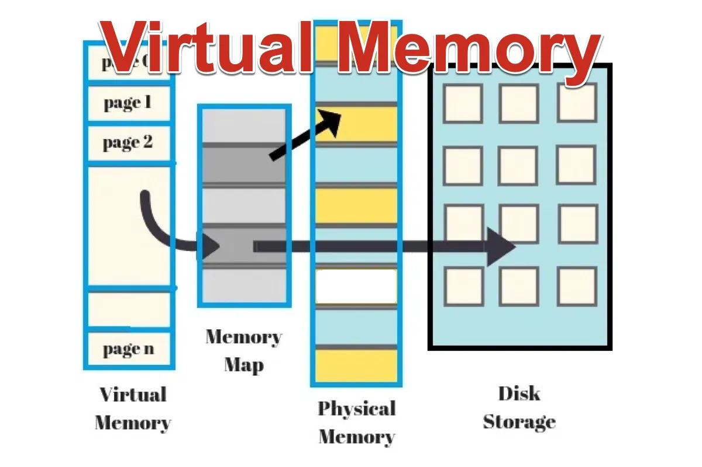

Adresování a správa paměti - Garbage collecting, Reference/ukazatele, Struktura paměti programu
===

Povídání
---

První věcí, kterou se hodí zmínit, je, že zde budeme brát v potaz fungování paměti, procesu a programu pouze v Linuxových operačních systémech. Kdyby někoho zajímalo, jaká je konkrétní implementace ve Vidlích, může si to nastudovat sám. Nicméně většina stěžejních konceptů by měla být pro všechny konvenční operační systémy stejná.                 
V této otázce se dostaneme hodně do hloubky. Proč? Nu, aby jsem vám dal dostatek prostoru a především, abyste si dovedli všechny koncepty hezky spojit.             
Začneme třeba u paměti, ta tak nějak prostupuje všemi třemi podtématy otázky .. a vlastně ji má otázka i ve jméně. Co to ta paměť vlastně je? Když mluvíme o paměti počítače, zpravidla máme na mysli operační pamět, tedy RAM (Random Access Memory). Existuje samozřejmě třeba i pamět cache, ale té se zde věnovat nebudeme. Na to je samostatná extra sekce.                    
Dobře, k čemu nám operační pamět vlastně je? Když počítač pracuje s programem, jeho instrukce musí být někde uložené tak, aby si je mohl procesor postupně brát a vykonávat. Když pomineme existenci právě té cache paměti, tyto instrukce bere právě z paměti RAM. Proč ne třeba z disku? No, protože čtení disku, byť třeba z toho nejrychlejšího SSD, je asi tisíckrát pomalejší, než čtení z operační paměti. To si ostatně ještě povíme, až přijde řeč na paměť swap. V operační paměti jsou tedy uloženy všechny informace o právě běžících programech. Procesor k nim přistupuje pomocí adres, o těch si také povyprávíme více do hloubky.               

Uděláme si takový rychlý vhled do hárdwéru. Na obrázku výše vidíte tři sběrnice. Podobně to vypadá i právě v našem počítači. Jedna je datová, ta mívá dnes zpravidla třeba 64 bitů, možná více, nejsem expert přes procesory. Druhá je adresová sběrnice. Ta se využívá právě k našemu přístupu k operační paměti. Typická velikost dnes bývá 48 bitů. Na této sběrnici se dnes také nachází jedna velmi užitečná komponenta, MMU (Memory Management Unit). Ta bude velmi důležitá záhy. Pro zajímavost, existují operační systému, které ji neumí využít. To může způsobovat určitě problémy, těmi se zde ale nebudeme zabývat. Poslední sběrnice je kontrolní a rovnou vám povím, že hardware umím tak maximálně rozflákat, takže vám jen stěží vysvětlím, k čemu konkrétně slouží, nicméně ji tam máme také a nesmíme na ni zapomínat.                       
Dobrá, teď již víme, že každá buňka v paměti má svou adresu. Co je jedna buňka? Byte, tedy 8 bitů. To je ale spíš taková HW buňka, náš počítač si s pamětí zachází tak trochu po svém, jak si brzy ukážeme. Jak taková adresa vypadá? No, třeba takto: *0xFFA3*. Přesně tak, adresy v paměti se zapisují v šestnáctkové soustavě (pokud neumíte šestnáctkovou soustavy ve čtvrtém ročníku, upřímnou soustrast). Je to nejintuitivnější zápis a rychle si na něj zvyknete.               

Tak, problematika, kterou si teď představíme, není úplně triviální a ani já v tom nejsem žádný expert. Pokud by vás to zajímalo více do hloubky, videa níže to dovedou efektivně vysvětlit. Budeme mluvit o konceptu virtuální paměti a stránkování. Nejdříve trocha historie. Ve starších operačních systémech a strojích nic jako virtuální pamět neexistovalo. Programy zkrátka seděly někde v paměti a využívaly ke svému běhu fyzické adresy. To mohlo způsobit např. to, že jste si přepsali jiný program, nebo rovnou něco, co má v paměti uložený kernel. Typicky třeba na vyšších adresách. To logicky úplně nechcete. Tento přístup také způsoboval spoustu jiných problémů. Co mu ale jistě nemůžeme odepřít je, že byl jednoduchý a rychlý.                 
S rostoucími požadavky programů na pamět a z hlediska bezpečnosti bylo rozhodně potřeba vymyslet něco lepšího. Tím lepším je virtuální pamět. Jednoduše řečeno, každý proces má pocit, jako by měl k dispozici sám pro sebe celé adresové pole, o které si zažádá. Pokud je potřeba dostat data z nějaké adresy, nevyužívají se adresy fyzické (tedy ty, na kterých v operační paměti skutečně leží daná informace), ale adresy virtuální. Virtuální adresy zde libovolně mapovat na fyzické. Toho se využívá např. u sdílených knihoven, kdy více programů má stránu namapaovanou na to jedno místo v paměti, ve kterém leží.                      
Jak to ale konkrétně funguje?

Materiály
---

Chris Kanich - Introduction to Processes in Linux - https://iv.ggtyler.dev/watch?v=WkuKhLYtUHw          
MIT OpenCourseWare - Basics of Virtual Memory - https://invidious.perennialte.ch/watch?v=8yO2FBBfaB0            
Tech With Nikola - But, what is Virtual Memory - https://invidious.nerdvpn.de/watch?v=A9WLYbE0p-I               
The Linux Foundation - Introduction to Memory Management in Linux - https://invidious.perennialte.ch/watch?v=7aONIVSXiJ8            
Computerphile - What's virtual memory? - https://invidious.jing.rocks/watch?v=5lFnKYCZT5o     

Coding With John - Java's Garbage Collection Explained - https://inv.nadeko.net/watch?v=Mlbyft_MFYM                 
Computerphile - Garbage Collection (Mark & Sweep) - https://invidious.perennialte.ch/watch?v=c32zXYAK7CI            

Alex Hyett - Stack vs Heap Memory - https://iv.ggtyler.dev/watch?v=5OJRqkYbK-4          
Mycodeschool - Pointers and dynamic memory - https://iv.ggtyler.dev/watch?v=_8-ht2AKyH4             

Bro Code - C pointers explained - https://iv.ggtyler.dev/watch?v=DplxIq0mc_Y            
Low Level - You will never ask about pointers again after watching this video - https://iv.ggtyler.dev/watch?v=2ybLD6_2gKM          

Coding with John - Java is Always pass by value. Here's why - https://iv.ggtyler.dev/watch?v=-5NC5_sI-vQ            
theteachr - Demystifiyng Pointers - Pass by Value vs. Pass by Reference - https://iv.ggtyler.dev/watch?v=qz_iz_PLorc            
Bro Code - C++ pass by value vs pass by reference - https://iv.ggtyler.dev/watch?v=ao0I1ViVV6U                  
Caleb Curry - C++ Programming Tutorial 67 Pass By Reference and Pass By Value - https://iv.ggtyler.dev/watch?v=FXzpFn8LJUI