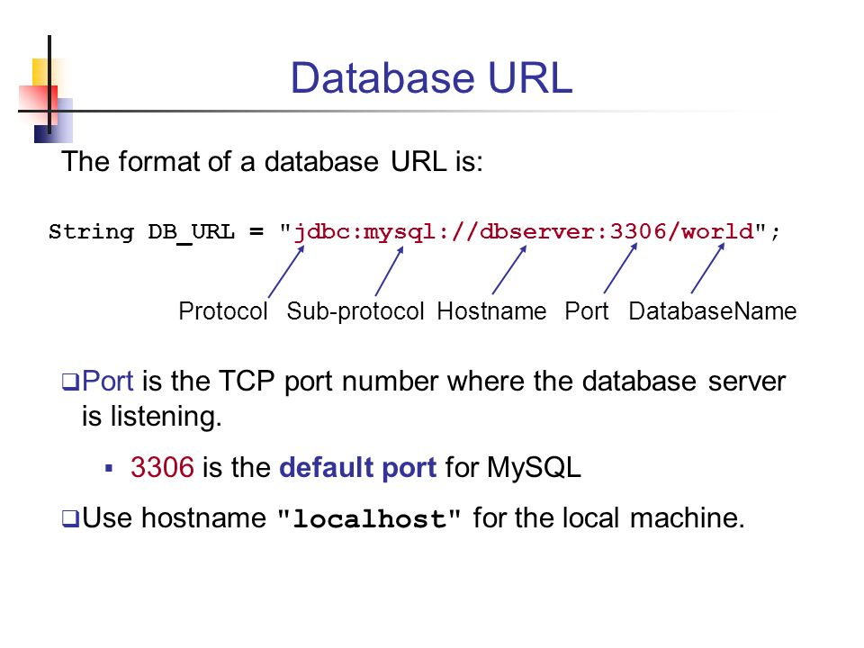
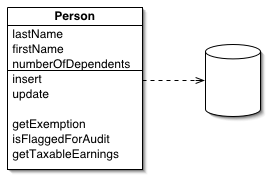

Komunikace s databázovým systémem - Připojení, Ukládání a načítání dat, Mapování entit v OOP
===

Povídání
---

Podíváme se, jak komunikovat s databázovým serverem pomocí naší aplikace. Co k tomu budeme potřebovat? V první řadě nějaký driver pro daný jazyk k dané databázi, který nám umožní s ní komunikovat. Dále budeme potřebovat znát adresu a port našeho DBMS a jméno naší databáze. Pak už jen potřebujeme údaje našeho uživatele. Z těchto údajů lze vytvořit URL databáze.              
V kódu pak můžeme vytvořit objekt, který bude představovat připojení do databáze. Samozřejmě pod podmínkou, že jsme se připojili úspěšně. Tento objekt nám poskytuje různé metody, pomocí kterých můžeme s databází komunikovat. Připojení k databázi bychom měli vždy uzavřít.             
Existuje několik způsobů jak vytvořit třídu, která může naše připojení hezky obalovat. Jedním z nich je návrhový vzor Singleton. Máme třeba aplikaci, ve které chceme vždy mít právě jedno připojení do databáze. To je docela běžná situace. Nedovolíme tedy vytvořit více připojení.          
Když budu čerpat z Moodlu, ten zmiňuje ještě třeba línou inicializaci. To znamená, že naše aplikace se k databázi připojí opravdu až ve chvíli, kdy jsme na ni provedli nějaký dotaz.               
Dále se může hodit jakási factory metoda, která nám může vyřešit některé případné výjimky nebo třeba místo vyhození výjimky vrátit None v případě nějaké chyby.         

Než se vrhneme na mapování objektů, řekneme si něco málo k ukládání a načítání věcí do databáze a z databáze.           
Vkládáme-li nějaká data do databáze, je naprosto nezbytné, abychom je ošetřili. Proč? Nu, protože uživatel umí být pěkný zlořád a mohl zkusit např. velmi nepěkný SQL Injection.            
Jak toho dosáhneme v kódu? Nu, buď můžeme využít regulární výrazy na ohlídání vstupů, nebo to za nás vyřeší nějaká knihovna. V Javě např. existuje tzv. prepared statement, který přesně tento problém řeší za programátora. Do SQL příkazů dáme místo proměnných otazníky. To později pomocí metod nahradíme našimi daty a voila, žádný zloun na nás s SQL Injection nevyzraje.                
Načítáme-li nějaká data z databáze je to podobný proces. V obou případech bychom si měli dávat pozor na konzistenci dat v naší databázi.            
Velmi důležitá věc, kterou bychom měli využít, jsou transakce. Každý set příkazů bychom měli uzavřít transakce. Můžeme buď vyřešit tento problém na straně databáze, tedy vytvořením různých procedůr, které budou samy implementovat transakce, nebo zkrátka a dobře zahájíme a ukončíme transakci přímo v našem kódu.             
Nesmíme zapomínat na to, že transakce nemusí vždy projít, takže v případě výjimky nebo chyby musíme provést rollback.           

Podívám se teď na samotné mapování entity a na nějaké pěkné způsoby, jak toho dosáhnout.            

Začneme tím neintuitivnějším způsobem. Na Moodlu je prezentovaný jako Active Record. V podstatě to znamená, že vezmeme záznam z tabulky a společně se všemi jeho atributy a metodami, které pro něj chceme implementovat, ho přepíšeme do objektu.          

Další možnost je trochu rafinovanější. Já ji zde budu pojmenovávat jako Table Data Gateway, nicméně z toho, co jsem pochopil, je velmi podobná, někdy v postatě to samé, jako DAO (Database Access Object). Někdě jsem našel, že rozdíl je v tom, že DAO má představovat záznam a Table Data Gateway tabulku. V realitě je to úplně jedno, takže se tím nemusíte zabývat a koukejte na to úplně stejně. I pan ředitel na Moodlu mezi tím zvlášť nerozlišuje.            
Dobře, v čem je tento přístup rafinovanější? Metody, které přistupují k databázi, úplně oddělíme od implementace našeho záznamu. Table Data Gateway tedy představuje v tabulku v tom, že metody, které implementuje, nejsou specifické pro žádný objekt, ale pracují nad objekty v dané tabulce. Kdykoliv chceme z našeho kódu k této tabulce přistupovat, potřebujeme právě Gateway daného objektu.            
Vyplatí se to také proto, že SQL logika je úplně oddělená od logiky objektu. Tedy vývojář, který si není jistý svými skilly v SQL, nemusí vůbec s SQL interagovat. Pouze spouští metody nabízené daným Gatewayem.               

Poslední možností, kterou si nastíníme, je tzv. Data Mapper. Data mapper je úplně odlišný přístup. Třída, která je mapována, nemusí svou strukturou vůbec korespondovat databázové tabulce. Při využívání vůbec neví, že nějaká databázová tabulka existuje a je s ní i tak pracováno. O všechnu práci při ukládání a načítání z databáze se stará její mapper. Ten svou interní logikou dovede třídu uložit do databázové tabulky, nebo ji přenést do objektu.

Jen zběžně si zmíníme, že existuje i jakýsi Repository pattern. Tento způsob reprezentace tabulky a práce s ním se podobá nějakému list, poli. Nebudeme si ho více rozebírat, ale můžete se na něj podívat.

Ukázky kódu
---

**Python - Database connection**
**Python - Entity mapping**
**Python - Storing and retrieving data**

**Java - Database connection**
**Java - Active record**
**Java - Table Data Gateway**
**Java - Data Mapper**
**Java - Storing and retrieving data**

**C++ - Database connection**
**C++ - Entity mapping**
**C++ - Storing and retrieving data**

Materiály
---

Sitepoint community - DAO vs ORM vs ActiveRecord vs TableGateway vs AHHHH! - https://www.sitepoint.com/community/t/dao-vs-orm-vs-activerecord-vs-tablegateway-vs-ahhhh/2473         

Martin Fowler - Data Mapper - https://martinfowler.com/eaaCatalog/dataMapper.html       
Martin Fowler - Table Data Gateway - https://martinfowler.com/eaaCatalog/tableDataGateway.html          
Martin Fowler - Active Record - https://martinfowler.com/eaaCatalog/activeRecord.html       
