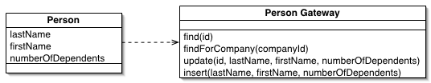

Komunikace s databázovým systémem - Připojení, Ukládání a načítání dat, Mapování entit v OOP
===

Povídání
---


Podíváme se, jak komunikovat s databázovým serverem pomocí naší aplikace. Co k tomu budeme potřebovat? V první řadě nějaký driver pro daný jazyk k dané databázi, který nám umožní s ní komunikovat. Dále budeme potřebovat znát adresu a port našeho DBMS a jméno naší databáze. Pak už jen potřebujeme údaje našeho uživatele. Z těchto údajů lze vytvořit URL databáze.              
V kódu pak můžeme vytvořit objekt, který bude představovat připojení do databáze. Samozřejmě pod podmínkou, že jsme se připojili úspěšně. Tento objekt nám poskytuje různé metody, pomocí kterých můžeme s databází komunikovat. Připojení k databázi bychom měli vždy uzavřít.             
Existuje několik způsobů jak vytvořit třídu, která může naše připojení hezky obalovat. Jedním z nich je návrhový vzor Singleton. Máme třeba aplikaci, ve které chceme vždy mít právě jedno připojení do databáze. To je docela běžná situace. Nedovolíme tedy vytvořit více připojení.          
Když budu čerpat z Moodlu, ten zmiňuje ještě třeba línou inicializaci. To znamená, že naše aplikace se k databázi připojí opravdu až ve chvíli, kdy jsme na ni provedli nějaký dotaz.               
Dále se může hodit jakási factory metoda, která nám může vyřešit některé případné výjimky nebo třeba místo vyhození výjimky vrátit None v případě nějaké chyby.                     
Ukážeme si praktický příklad singleton připojení v Javě. Takhle může vypadat třída pro připojení do databáze, která implementuje Singleton pattern a určitou formu líné inicializace (Connection je vytvořen a inicializován až v případě, že uživatel potřebuje Connection):

```Java
package database;

import java.sql.Connection;
import java.sql.DriverManager;
import java.sql.SQLException;

public class DatabaseConnection {
    
    private static DatabaseConnection instance = null;
    private Connection connection;

    private String url;
    private String username;
    private String password;

    private DatabaseConnection(String url, String username, String password){
        this.url = url;
        this.username = username;
        this.password = password;
    }

    public static DatabaseConnection connect(String url, String username, String password){
        if(instance == null){
            instance = new DatabaseConnection(url, username, password);
        }
        return instance;
    }


    public Connection getConnection() throws SQLException{
        if (connection == null || connection.isClosed()){
            connection = DriverManager.getConnection(url, username, password);
        }
        return connection;
    }

    public void closeConnection() throws SQLException{
        if(connection != null){
            connection.close();
        }
    }
}
```

Než se vrhneme na mapování objektů, řekneme si něco málo k ukládání a načítání věcí do databáze a z databáze.           
Vkládáme-li nějaká data do databáze, je naprosto nezbytné, abychom je ošetřili. Proč? Nu, protože uživatel umí být pěkný zlořád a mohl zkusit např. velmi nepěkný SQL Injection.            
Jak toho dosáhneme v kódu? Nu, buď můžeme využít regulární výrazy na ohlídání vstupů, nebo to za nás vyřeší nějaká knihovna. V Javě např. existuje tzv. prepared statement, který přesně tento problém řeší za programátora. Do SQL příkazů dáme místo proměnných otazníky. To později pomocí metod nahradíme našimi daty a voila, žádný zloun na nás s SQL Injection nevyzraje.                
Načítáme-li nějaká data z databáze je to podobný proces. V obou případech bychom si měli dávat pozor na konzistenci dat v naší databázi.            
Velmi důležitá věc, kterou bychom měli využít, jsou transakce. Každý set příkazů bychom měli uzavřít do transakce. Můžeme buď vyřešit tento problém na straně databáze, tedy vytvořením různých procedůr, které budou samy implementovat transakce, nebo zkrátka a dobře zahájíme a ukončíme transakci přímo v našem kódu.             
Nesmíme zapomínat na to, že transakce nemusí vždy projít, takže v případě výjimky nebo chyby musíme provést rollback.               
Rozšíříme si nyní náši DatabaseConnection o metodu, která nám dovolí provést nějaký příkaz (query). Vytvoří prepared statement a vrátí nám ho. Obsahuje-li prepared statement nějaké argumenty, musíme je pomocí set metod (setInt, setString, ...) vložit. Set metoda vždy akceptuje číslo a hodnotu. Číslo reprezentuje pořadí otazníku v PreparedStatementu, který chceme nahradit, zleva doprava. Hodnota je prostě hodnota, kterou ho nahradíme.           
Teď už nám stačí jen statement spustit a uložit výsledky. Ty uložíme do tzv. ResultSetu. Ten funguje jako kurzor a má uložená naše data. Lze ho procházet podobně jako iterátor, pomocí metody *next()*.                
V kódu využívám tzv. try with resource. To znamená, že do try bloku vložím nějaký objekt, který lze uzavřít po skončení práce s ním, nebo v případě vyhození výjimky. O vše se mi tak postará tento try block.

```Java
package database;

import java.sql.PreparedStatement;
import java.sql.ResultSet;
import java.sql.SQLException;

public class Main{
    public static void main(String[] args) {
         DatabaseConnection myConnection = DatabaseConnection.connect("DatabaseURL", "username", "password");
         try(PreparedStatement preparedStatement = myConnection.prepareStatement("SELECT * FROM students WHERE name = ?")){
            try(ResultSet resultSet = preparedStatement.executeQuery()){
                while(resultSet.next()){
                    // Muzeme pracovat s nasimi daty
                }
            } 
         } catch (SQLException e){
            System.out.println("An Exception Has Occured");
         } catch (Exception e){
            System.out.println("You're fucked..");
         }
    }
}

package database;

import java.sql.Connection;
import java.sql.DriverManager;
import java.sql.PreparedStatement;
import java.sql.SQLException;

public class DatabaseConnection {
    
    private static DatabaseConnection instance = null;
    private Connection connection;

    private String url;
    private String username;
    private String password;

    private DatabaseConnection(String url, String username, String password){
        this.url = url;
        this.username = username;
        this.password = password;
    }

    public static DatabaseConnection connect(String url, String username, String password){
        if(instance == null){
            instance = new DatabaseConnection(url, username, password);
        }
        return instance;
    }


    public Connection getConnection() throws SQLException{
        if (connection == null || connection.isClosed()){
            connection = DriverManager.getConnection(url, username, password);
        }
        return connection;
    }

    public void closeConnection() throws SQLException{
        if(connection != null){
            connection.close();
        }
    }

    public PreparedStatement prepareStatement(String query) throws SQLException{
        if (connection == null || connection.isClosed()){
            connection = DriverManager.getConnection(url, username, password);
        }
        return connection.prepareStatement(query);
    }
}
```

Samozřejmě ideálně bychom do naše dotazy měli psát do transakcí. Tím se tu nebudeme zbytečně obtěžovat. Ale je dobré to vědět.                  
Stejné příklady v Pythonu by mohly vypadat nějak takhle:

```Python

```

Podívám se teď na samotné mapování entity a na nějaké pěkné způsoby, jak toho dosáhnout.            


Začneme tím neintuitivnějším způsobem. Na Moodlu je prezentovaný jako Active Record. V podstatě to znamená, že vezmeme záznam z tabulky a společně se všemi jeho atributy a metodami, které pro něj chceme implementovat, ho přepíšeme do objektu.          
V Javě to může vypadat třeba nějak takhle:

```Java

```

A v Pythonu takto:

```Python

```



Další možnost je trochu rafinovanější. Pojmenujeme ji Table Data Gateway. Je to objekt, který zprostředkovává vždy přístup k jedné tabulce. Dovede nám načítat záznamy, ukládat nové, ... Vrací nám zpravidla nějaký result set, s tím si pak můžeme hrát, jak uznáme za vhodné. Velká výhoda tohoto přístupu je, že vývojář je odstíněn od implementace v SQL. Pouze volá metody Gateway.                  
Druhý, velmi podobný přístup je DAO (Database Access Object). Má v podstatě jen jeden rozdíl. Nutně nezprostředkovává interface k jedné tabulce, ale poskytuje metody pro práci s nějakým objektem. To znamená, že implementujeme tabulku v databázi jako třídu, sloupce jako vlastnosti třídy. Všechny operace (insert, update, delete, něco navíc) deleguje na naše DAO. DAO nám tedy nevrací nějaký resultset, ale konkrétní objekt, list objektů. Nebo na takovém objektu provádí nějaké operace.               
Konkrétní příklad DAO v Javě může vypadat třeba takto:

```Java

```

A v Pytonu takto:

```Python

```


Poslední možností, kterou si nastíníme, je tzv. Data Mapper. Data mapper je úplně odlišný přístup. Třída, která je mapována, nemusí svou strukturou vůbec korespondovat databázové tabulce. Při využívání vůbec neví, že nějaká databázová tabulka existuje a je s ní i tak pracováno. O všechnu práci při ukládání a načítání z databáze se stará její mapper. Ten svou interní logikou dovede třídu uložit do databázové tabulky, nebo ji přenést do objektu.

Jen zběžně si zmíníme, že existuje i jakýsi Repository pattern. Tento způsob reprezentace tabulky a práce s ním se podobá nějakému list, poli. Nebudeme si ho více rozebírat, ale můžete se na něj podívat.

Materiály
---

Sitepoint community - DAO vs ORM vs ActiveRecord vs TableGateway vs AHHHH! - https://www.sitepoint.com/community/t/dao-vs-orm-vs-activerecord-vs-tablegateway-vs-ahhhh/2473         

Martin Fowler - Data Mapper - https://martinfowler.com/eaaCatalog/dataMapper.html       
Martin Fowler - Table Data Gateway - https://martinfowler.com/eaaCatalog/tableDataGateway.html          
Martin Fowler - Active Record - https://martinfowler.com/eaaCatalog/activeRecord.html       
