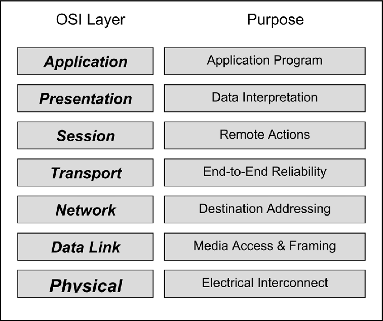
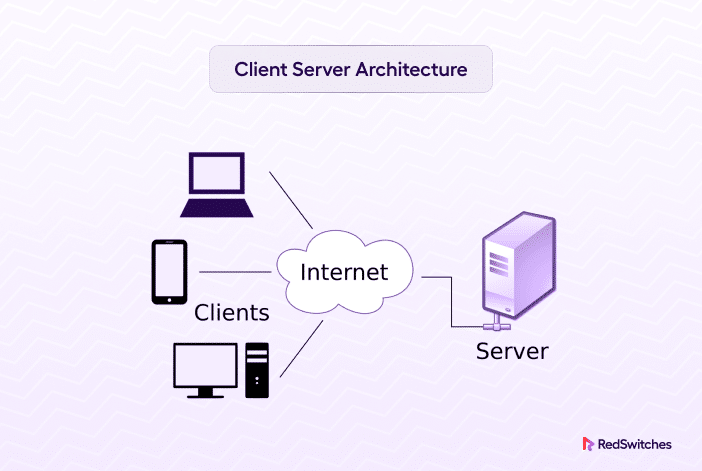
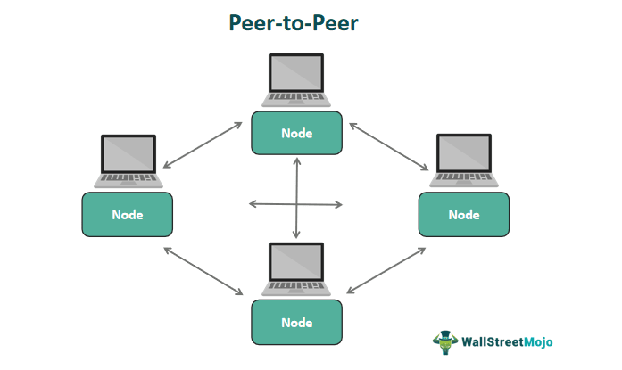

Komunikace v síti - tvorba síťových aplikací, Berkeley socket a jeho rozhraní
===

Podíváme se teď na síťové aplikaci a jejich tvorbu. V moderních programovacích jazycích domestikoval tzv. Berkeley socket interface.     



Uděláme si takový malý vhled do počítačových sítí, abychom pochopili, proč potřebujeme takový level abstrakce. Máme síťový model, který má hned několik vrstev. Říkáme mu ISO/OSI model, popř. TCP/IP, kde jsou některé vrstvy spojené.              
Spodní vrstvy se starají fyzickou implementaci, tedy přenos bitů po síti. Jako programátora by nás nemělo zajímat, zda se bude signál přenášet bezdrátově či po kabelu. Podobně by nás nemuselo zajímat, kudy naše data poletí, zda se dostanou k cíli, popř. jejich retransmitace a tak podobně. To vše zajišťují spodní vrstvy a protokoly. Píšeme-li síťovou aplikaci, konkrétní implementace a funkce spodních vrstev vědět nepotřebujeme.           


Je nám prezentováno jen jednoduché rozhraní, pomocí kterého můžeme interagovat se sítí. Berkeley socket je jakž takž standardizovaný. Stěžejním konceptem Berkeley socketu je .. no, socket. Ze síťování známe socket jako spojení IP adresy a portu. Zde je socket jakýsi objekt, přes kterým můžeme se sítí komunikovat. Nicméně platí, že musí mít ip adresu a port.                  
Máme také tzv. serverový soket a klientský soket. K tomu serverovému se může ten klientský připojit.                
Když vytváříme serverový soket, musíme nejdříve provést operaci bind, která soket napojí na určitý port a IP adresu.        
Pak lze zavolat listen, který označí soket jako pasivní. Tedy, že bude poslouchat pro příchozí spojení.                 
Následně lze využít metody accept, která je blokující, takže kód se zde zastaví, dokud se se soketem nespojí nějaký klientský soket.            
Lze pak využít metod pro recieve a send pro příjem a zaslání dat přes síť. Data se přes síť posílají zásadně v bytech. Záleží na konkrétní implementaci v konkrétním jazyce, zda musíte data nějakým způsobem parsovat, nebo si to knihovna pro Berkeley soket vyřeší sama.             
Je důležité soket také zavřít. To můžeme udělat na základě nějakého uživatelského příkazu, nebo pomocí nějakého timeoutu při dlouhé neaktivitě klienta.                 
Timeout je důležitá věc v síti. Většina zařízení na síti má pro komunikaci implementovaný nějaký timeout. Nemůžeme si být jisti, jak tyto timeouty přesně vypadají, proto je dobrým zvykem vytvořit vlastní timeouty v našem kódu, nejlépe nastavitelné.                
Serverové vlákno zpravidla vytváří pro každé spojení vlastní vlákno. Konkrétně vytvoří klientské vlákno, které si povídá s připojeným uživatelem. Takto lze obsluhovat více spojení najednou.               
Samozřejmě se na konci také musí zavřít samotné serverové vlákno.                   
Takhle může vypadat velmi jednoduchý server v Pythonu. Počká na spojení a následně do nekonečná odpovídá "Message recieved ...". Po uzavření spojení uzavře klientský i serverový soket a program skončí. Nevyužívá vláken, může tedy obsluhovat pouze jedno spojení, což není ideální, ale na ukázku to stačí.

```Python
import socket   # Knihovna pro komunikaci v siti

sc = socket.socket(socket.AF_INET, socket.SOCK_STREAM)  # Vytvorime socket. AF_INET znamena, ze pouzivame IPv4 adresy (AF_INET6 by byly IPv6). SOCK_STREAM udava protokol, zde TCP
sc.bind(("localhost", 8080))    # Je potreba napojit socket na urcitou ip adresu a port. localhost se prelozi nejspis na 127.0.0.1 a port mame 8080. Je nutne tyto dve hodnoty zadat v tuplu
sc.listen() # Operace listen() rekne OS, ze tento soket je pasivni, bude poslouchat a prijimat spojeni
client, addr = sc.accept()  # Blokujici metoda accept(). Po uspesnem pripojeni vrati klientsky soket a adresu pripojeneho klienta
try:
    while True:
        msg = client.recv(1024) # Serverova vlakno se zastavi, dokud od klienta nedostane odpoved. Cislo 1024 udava velikost bufferu, tedy maximalni velikost zpravy zaslane od klienta
        client.sendall("Message recieved\n".encode())   # Zasle klientovi zpravu. Sendall() se postara o to, aby byl opravdu zaslan cely buffer najednou. Encode() zpravu zakoduje do binarni podoby
except:
    pass
finally:    # Musime uzavrit vsechny sokety
    client.close()
    sc.close()
```

Takhle by mohl vypadat server v Javě:

```Java
import java.io.BufferedReader;
import java.io.InputStreamReader;
import java.io.PrintWriter;
import java.net.ServerSocket;
import java.net.Socket;

public class Main{

    public static void main(String[] args) {
        ServerSocket socket = null;
        BufferedReader input = null;
        PrintWriter output = null;

        try{
            socket = new ServerSocket(8080);
           
            Socket s = socket.accept();

            input = new BufferedReader(new InputStreamReader(s.getInputStream()));
            output = new PrintWriter(s.getOutputStream());

            String line = "";

            while ((line = input.readLine()) != null){
                line = input.readLine();
                output.println(line);
                output.flush();
            }

        } catch (Exception e){

        } finally {
            try{
                if (socket != null){
                    socket.close();
                }
                if (input != null){
                    input.close();
                }
                if(output != null){
                    output.close();
                }
            } catch (Exception e){

            }
        }
    }
}
```

Klientské vlákno se chová mírně odlišně. Po vytvoření musíme využít metodu connect, která dovede klientské vlákno dovede spojit s nějakým serverovým vláknem na základě zadané IP adresy a portu.           
Komunikace pak opět probíhá stejně, metodami send a recieve. Opět připomínám, že připojení musíme na konci uzavřít.            



Síťové aplikace mohou mít několik základních podob. Jednou z nich je architektura klient-server. Na této architektuře pracuje třeba databázový server, webový server atp. Jednoduše, je jeden server, který přijímá a odbavuje libovolné množství klientských připojení.                



Druhou základní možností je architektura P2P (Peer-to-peer). Zde není žádný centrální server, ale každé zařízení dovede fungovat jako server i jako klient. Zpravidla může každé zařízení komunikovat s každým pomocí nějakého společného protokolu. Na této architektuře funguje třeba Torrent. Je několik nodů, kdy žádný nemá celou část požadovaného souboru, ale každý má nějakou a komunikují spolu za účelem nalezení a složení celého souboru.

Jako možnost architekturu lze ještě brát třeba dedikovanou komunikaci mezi dvěma zařízeními. Příkladem využití takové architektury je např. Bluetooth.

Materiály
---

Wikipedia - Berkeley sockets - https://cs.wikipedia.org/wiki/Berkeley_sockets       
GeeksForGeeks - Client-Server model - https://www.geeksforgeeks.org/client-server-model/            
GeeksForGeeks - Peer-to-peer - https://www.geeksforgeeks.org/what-is-p2p-peer-to-peer-process/

