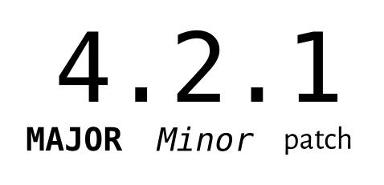
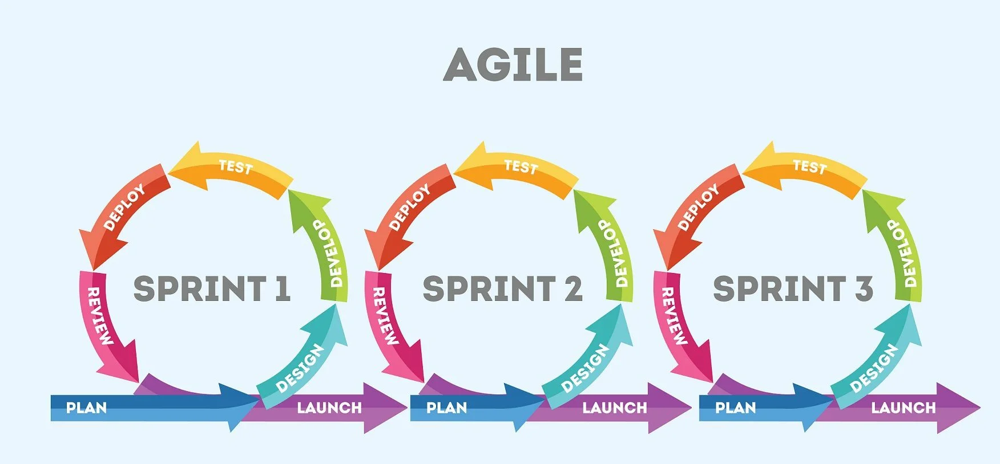

Metodiky a životní cyklus vývoje softwaru
===

Povídání
---

Začneme klasikou, vodopádovým modelem. Ten by měl zároveň účinně představit otázku.

Vodopádový model je jakýsi prehistorický model postupu při vývoji nějakého projektu. Začíname kompletními požadavky zákazníka, vytvoříme design, vyvineme aplikaci, otestujeme ji, nasadíme ji a sledujeme její běh. Důležité také je, že každý jeden krok může začít být vykonáván až po tom předchozím. Nesměli bychom tak třeba začít s testováním, dokud jsme celou aplikaci nedokončili.                 
Kde je problém? Dostaneme-li se do další části vývoje, správně bychom již neměli nikdy putovat zpátky. Takže podle toho pravého vodopádového modelu, když nám aplikace neprojde testy, celou ji zahodíme a začínáme opět požadavky zákazníka nebo designem aplikace. Můžete si asi představit, že v praxi je tento přístup tak docela nevyužitelný.         
V realitě tedy třeba na menších projektech lze implementovat jistou formu vodopádového modelu, kde se ale lze vrátit o jeden stupeň zpět.               
Trochu praktičtějším modelem vývoje projektu je model iterativní.         

Tento model už je trochu chytřejší. Vývoj softwaru rozdělíme do několika fází, iterací. Na konci každé dostaneme fungující verzi softwaru. Následně se vracíme k požadavkům a pokračujeme v jejich implementaci pro další verzi softwaru.               
Má velikou výhodu v tom, že mezi jednotlivými iteracemi probíhá komunikace se zákazníkem. Takže se lépe přizpůsobuje změnám v požadavcích. Také je mnohem tolerantnější k týmu, který se s nástroji vývoje teprve řádně učí.            
Nicméně mimo jiné trpí trochu opačným problémem, než jeho předchůdce vodopádový model. Lze ho smysluplně uplatnit jen při větších projektech, protože ne každý projekt jde rozdělit tak, aby na konci každé iterace vznikla funkční verze projektu.     
Když už jsme si zmínili ty verze, může si ukázat, jak se typicky verzuje projekt.           

Naprosto klasické je verzování číselné. Zpravidla máme dvě nebo tři čísla. První je tzv. Major, hlavní číslo. Označuje nějaký velký patch, zpravidla měnící zásadní aspekty aplikace. Důležitá zde je rizikovost změn. Pokud je velké riziko, že změna aplikaci nějak rozhází, je pro takovou verzi změněno hlavní číslo. Druhé, Minor, označuje změnu, která představuje menší riziko, nicméně aplikaci nějakým způsobem mění, něco přidává. Poslední číslo je pouze pro nějaké patche.            
Když už jsem se zmínil o verzích, můžu rovnou zmínit rozdíl mezi Alpha verzí a Betou. V podstatě, na základě toho, co jsem našle na Wikipedii, Aplha verze je stále nějaká testovací verze, která zpravidla nebývá vypuštěna do světa. Beta verze by na druhou stranu měla být tzv. feature-complete. To znamená, že všechny hlavní fíčury jsou již implementované. Nicméně se buď ví, nebo se předpokládá, že v dané verzi se budou nacházet nedostatky a bugy. Často se tedy taková verze, např. v případě počítačových her, vypouští do světa. Třeba pro hráče, kteří ji pak mohou otestovat a předat informace o chybách, které tam našli. Navíc se tak hra vyzkouší v ostrém provozu.          
Začneme se teď věnovat jedné velmi oblíbené filosofii pro vývoj softwaru, říká se jí Agile. Existuje několik možných způsobů, jak ji implementovat, resp. metodologií. Agile proces může vypadat nějak takhle:

Skládá se z několika sprintů. Každý sprint je v podstatě jedna iterace. Na konci každého sprintu by měl vzniknout opět hotový projekt nebo nějaká hotová fíčura. Rozdíl je v tom, že Agile se řídí tzv. agilním manifestem. Tento manifest obsahuje v podstatě jen 4 věty. Od těchto vět se odvijí způsob fungování v podstatě všech metodoligií na něm založených.                 
Kdybych to měl shrnout, tak agilní způsob vývoje by se měl snažit aktivně komunikovat se zákazníkem, umět dobře reagovat na změny, soustředit se na rozvoj svých zaměstnanců i jako jednotlivců a podporovat efektivní komunikaci mezi nimi. Někdy lze pověřit i člověk funkcí tzv. agilního kouče. Ten má za úkol motivovat jednotlivé vývojářské týmy ke komunikaci, pomáhat řešit problémy a starat se o hladký průběh vývoje v těchto ohledech.             
Základem agilním metodik je tzv. sprint. Sprint je časové obdoví, ve kterém má tým vykonat nějaký set práce. Mohou to být třeba tasky v softwaru, jakým může být třeba Clickup nebo Jira.

Materiály
---

Tutorialspoint - SDLC - https://www.tutorialspoint.com/sdlc             
Wikipedia - Software versioning - https://en.wikipedia.org/wiki/Software_versioning     
Wikipedia - Software release lifecycle - https://en.wikipedia.org/wiki/Software_release_life_cycle      
Agilní manifest - https://agilemanifesto.org/iso/cs/manifesto.html              

