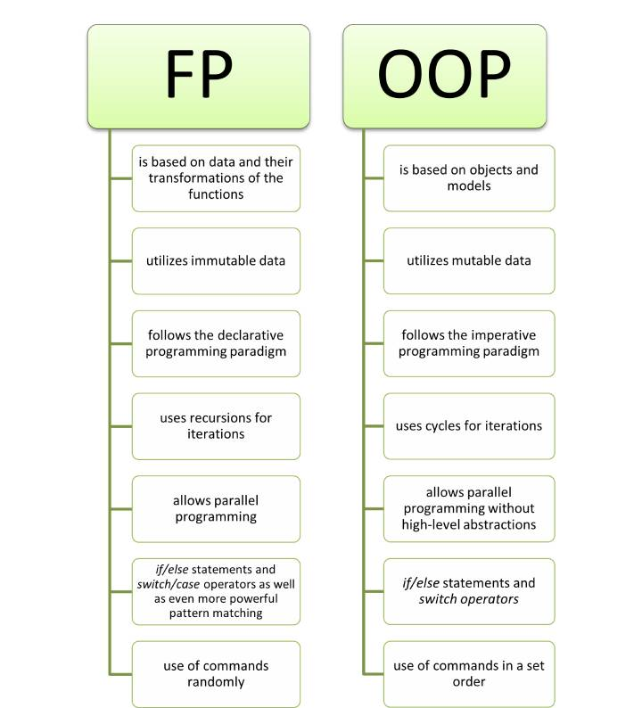

Principy objektového programování, agregace a kompozice objektů
===

Povídání
---



Uděláme si takové zajímavé cvičení. Uvaříme si objektově orientované programování. Existují dva základní způsoby programování, funkcionální a objektové.                
O funkcionálním programování se tu nebudeme moc bavit, nicméně to je založené na tom, že máme nějaké proměnné a funkce, pomocí kterých na nich můžeme něco provádět. Někdy nám naprosto postačí, ale na některé příklady se nehodí a právě takový příklad si ukážeme.    

Řekněme, že máme zvířátka a farmu. Máme různé druhy zvířátek a potřebujeme jich vytvořit několik. Začneme naprosto intuitivním řešením. Pro každé zvířatko počet proměnných, který bude reprezentovat jejich vlastnosti. Pak uděláme funkce, které jednotlivá zvířátka potřebují.       
Nu, podívejme se teď na náš kód.

```
pig.name = Piggy
pig.weight = 40
pig.height = 50
pig.is_well_fed = True

cow.name = Cowie
cow.weight = 100
cow.is_healthy = True
cow.is_pregnant = True

dog.name = Rex
dog.weight = 12
dog.is_happy = True

func feed(pig):
    pig.is_well_fed = True

func take_care(cow):
    cow.is_healthy = True

func pet(dog):
    dog.is_happy = True
```

Vypadá trochu zvláštně že? Je zde hodně proměnných a s každým dalším zvířátkem se jejich počet značně zvyšuje. Natož abychom je chtěli nějak uložit na farmu.           
V tuto chvíli nám přichází na pomoc právě OOP. OOP je postavené především na určité abstrakci. Vytvoření počtu proměnných v paměti se nevyhneme, nicméně díky OOP to můžeme udělat tak, že kód bude mnohem čitelnější a škálovatelnější.            
Budeme-li třeba chtít přidat psa, bude nám na to stačit pouze jeden řádek místo 5.          
OOP nám nabízí možnost vytvořit tzv. třídu. Proměnné, které ve třídě deklarujeme, se nazývají vlastnosti třídy a funkce metody. Vidíte, jak každá funkce výše má jako parametr zvířátko, se kterým pracuje? Podobně je tomu i u OOP. Spíše než podobně vlastně úplně stejně.            
Metody, nebereme-li v potaz ty statické, jsou v postatě jen funkce, které mají jako první parametr objekt, se kterým pracují.               
To je nám ale zpravidla skryto, proto ta abstrakce. Třídy tedy dovedou šikovně spojit společné proměnné a funkce do jednoho konstruktu.             
Ten může vypadat třeba takhle:

```

class Pig:

    name = Piggy
    weight = 40
    height = 50
    is_well_fed = True

    func feed():
        is_well_fed = True

class Cow:

    name = Cowie
    weight = 100
    is_healthy = True
    is_pregnant = True

    func take_care():
        is_healthy = True

class Dog:

    name = Rex
    weight = 12
    is_happy = True

    func pet():
        is_happy = True
```

To už vypadá trochu lépe ne? Nuže, máme tu ještě jeden menší problém. Všechny třídy mají společné atributy. OOP nabízí jeden koncept, který nám ušetří toto opakování, dědičnost. Tu jsme již řádně probrali v minulé otázce, odkazuji se tedy tam.                 
Aby nám třídy také k něčemu byly, potřebovali bychom vytvořit tzv. konstruktor. Třída je tedy jen takový blueprint. Můžeme vytvořit její instanci a pomocí konstruktoru nastavit její vlastnosti a metody. **Vlastnost** je proměnná uvnitř třídy. **Metoda** je funkce uvnitř třídy.    
Důležitým konceptem OOP je tzv. zapouzdření. To znamená, že vlastnosti a metody třídy lze deklarovat jako soukromé a mimo samotnou třídu na ně nelze sáhnout. Pro přístup k vlastnostem se pak dělají gettery a settery. V nich lze nastavit např. nějaké kontroly.         
Dále každý správný objekt potřebuje konstruktor. To je metoda, která se volá při jeho inicializaci. Nastaví základní hodnotu objektů, tedy je inicializuje.             
Koncept polymorfismu jsme již také probrali v otázce o dědičnosti. 
Různé programovací jazyky si dělají OOP po svém. My si ukážeme tři různé.               
Začneme Pythonem. Tam může OOP vypadat třeba nějak takto:

```Python
class Pig:

    def __init__(self, name, weight, height, is_well_fed):  # Kontruktor. Vola se pro inicializaci objektu
        # Vlastnosti tridy
        self.name = name
        self.weight = weight
        self.height = height
        self.is_well_fed = is_well_fed

    # Metoda
    def feed(self):
        self.is_well_fed = True
        print("Nom, Nom, delicious")

    # Double undescore metoda 
    def __str__(self):
        return "Hello I am " + self.name


if __name__ == "__main__":     # Pythonovska Main metoda
    pig1 = Pig("Peppa", 37, 70, False)
    pig2 = Pig("Tom", 60, 85, True)

    print(pig1)
    print(pig2)
```

Python je ale stále primárně skriptovací jazyk. Jeho OOP má tedy značné nevýhody. Výhodou jsou tzv. dunder (double underscore) metody. Ty dovedou např. přepsat operátory nebo ovlinit chování nějakých funkcí (V příkladu třeba *print*). Nevýhodou je naopak třeba, že princip zapouzdření tak úplně nefunguje (k vlastnostem třídy se lze za každých okolností nějak dostat, nelze je úplně odstínit od vnějšího světa).                     
Zajímavým protikladem je např. Java. Ta je už od začátku navržena čistě objektově. To znamená, že i pro spuštění jakékoliv aplikace musí existovat alespoň jedna třída, *Main*. V Main třídě se nachází tzv. Main metoda. Ukážeme si ji v kódu. Při zpuštění kódu se začně spouštět právě kód v této metodě. V Javě tím pádem v podstatě neexistují klasické funkce, protože vše musí být implementováno jako metoda. Snad s výjimkou lambda funkcí.                
Kód rovný tomu výše lze zapsat v Javě třeba takto:          

```Java
public class Main {
    public static void main(String[] args) {
      Pig pig1 = new Pig("Peppa", 37, 70, false);
      Pig pig2 = new Pig("Tom", 60, 85, true);

      System.out.println(pig1);
      System.out.println(pig2);
    } 
}

public class Pig {

    // Deklarace vlastnosti trid
    private String name;
    private int weight;
    private int height;
    private boolean well_fed;

    public Pig(String name, int weight, int height, boolean well_fed){  // Konstruktor
        // Inicializace vlastnosti trid. *this* referuje na danou instanci tridy
        this.name = name;
        this.weight = weight;
        this.height = height;
        this.well_fed = well_fed;
    }

    // Metody pro zapouzdreni. Vlastnosti jsou private, nelze na ne sahnou zvenci. Proto vytvorime metody pro manipulaci s nimi
    public int getHeight() {
        return height;
    }

    public String getName() {
        return name;
    }

    public int getWeight() {
        return weight;
    }

    public boolean Is_well_fed() {
        return well_fed;
    }

    public void setHeight(int height) {
        this.height = height;
    }
    
    public void setName(String name) {
        this.name = name;
    }
    
    public void setWeight(int weight) {
        this.weight = weight;
    }

    public void setWell_fed(boolean well_fed) {
        this.well_fed = well_fed;
    }

    @Override
    public String toString() {
        return "Hello I am " + this.name;
    }
}
```

v C++ je to velmi podobné, jako v Javě. Nicméně narozdíl od Javy, C++ není tak striktně objektové.

```C++
#include <iostream>

using namespace std;

class Pig{
    // Deklarace vlastnosti
    private:
        string name;
        int weight;
        int height;
        bool well_fed;

    public:
        Pig(string name, int weight, int height, bool well_fed){
            // Inicializace vlastnosti. *this* je pointer na aktualni instanci tridy
            this->name = name;
            this-> weight = weight;
            this->height = height;
            this->well_fed = well_fed;
        }
        
        string getName() const{
            return name;
        }

        int getWeight(){
            return weight;
        }

        int getHeight(){
            return height;
        }

        int isWellFed(){
            return well_fed;
        }

        void setName(string name){
            this->name = name;
        }
       
        void setWeight(int weight){
            this->weight = weight;
        }

        void setHeight(int height){
            this->height = height;
        }

        void setWellFed(bool well_fed){
            this->well_fed = well_fed;
        }

};

ostream& operator<<(ostream& os, const Pig& pig){
    os << "Hello I am " << pig.getName();
    return os;
}

int main(){
    
    Pig *pig1 = new Pig("Peppa", 37, 70, false);    
    Pig *pig2 = new Pig("Tom", 60, 85, true);  
    
    cout << *pig1 << endl;
    cout << *pig2 << endl;

    return 0;
}
```


Je zde zmíněná i agregace a kompozice objektů. To je spíše takový fancy název. V podstatě, nahoře na obrázku je to pěkně vysvětlené, pokud třída A je naprosto závislá na třídě B a nemůže bez ní existovat, jedná se o kompozici.              
V případě, že třída A může existovat sama o sobě, jde o agregaci.           
Využívá se toho např. kdybychom chtěli dát zvířátka do naší farmy. Měli bychom nějaký list zvířátek, do kterého bychom je ukládali. To by byla agregace, protože zvířátko může existovat samo o sobě.                   
Takže v podstatě uložíme objekt do objektu. K uloženému objektu pak přistupujeme jen a pouze přes objekt, ve kterém je uložen.


Určitě stojí za to zmínit jednu speciální metodu, kterou zpravidla každá třída mívá, konstruktor. Tato metoda je zodpovědná za inicializaci objektu. Tedy za inicializaci jejich proměnný, popř. načtení jejich hodnot ze souboru.          
Konstruktor může být i prázdný, nemá-li smysl pro třídu nic inicializovat

Ukázky kódu
---

**Python - OOP**
```Python
class Square():

    # Konstruktor
    def __init__(self, a):
        self._a = a

    def set_a(self, a):
        self._a = a

    def get_a(self):
        return self._a
    
    def get_area(self):
        return self._a**2
    

if __name__ == "__main__":
    s1 = Square(5)
    
    print(s1.get_a())
    print(s1.get_area())
```

**Java - OOP**

```Java
class Main{

    static class Square{
        private int a;

        public Square(int a){
            this.a = a;
        }

        public int getA(){
            return this.a;
        }

        public void setA(int a){
            this.a = a;
        }

        public int getArea(){
            return a*a;
        }
    }

    public static void main(String args[]){
        Square s1 = new Square(10);
        System.out.println(s1.getA());
        System.out.println(s1.getArea());
    }
}
```

**C++ - OOP**

```C++
#include <iostream>

using namespace std;

class Square{
    private:
        int a;

    public:
        Square(int a){
            this->a = a;
        }

        int getA(){
            return this->a;
        }

        void setA(){
            this->a = a;
        }

        int getArea(){
            return this->a*this->a;
        }
};

int main(){
    Square s1 = Square(5);

    cout << s1.getA() << endl;
    cout << s1.getArea() << endl;

    return 0;
}
```

Materiály
---

Programming with Mosh - Object-Oriented Programming, Simplified -                   
GeeksForGeeks - Association, Composition and Aggregation in Java -              
Packt - Java: Object-Oriented Programming Concepts: Associations, Aggregation & Composition -                   
CodeAesthetic - The Flaws of Inheritance -              
Ave Coders - Python OOP Composition Clearly Explained -                 
Bro Code - Learn Python Composition in 7 minutes -              
0612 TV w/ NERDfirst - Composition & Aggregation -                          
BasicOverflow - FP vs OOP | For Dummies -           