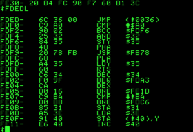
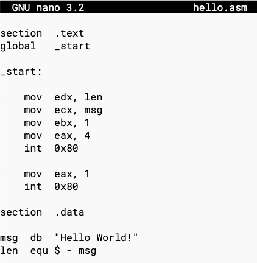

Programovací jazyky - vlastnosti, srovnání, popis způsobu tvorby i běhu programů
===

Povídání
---

Nebudeme se zbytečně zabývat tím, jak bychom definovali programovací jazyk. Budeme ho chápat jako nástroj k napsání nějakého programu.

Uděláme si ale takový rychlý vhled do historie. V dobách dávno minulých nic jako programovací jazyk neexistovalo. Jediným způsobem, jak napsat nějaký počítačový program, bylo zapsat ho přímo ve strojovém kódu pomocí intrukcí. Na obrázku výše máte zhruba, jak to mohlo vypadat. Strojový kód je to, čemu počítač opravdu rozumí. Každý program je dřív, nebo později převeden právě do strojového kódu.                
Strojový kód je závislý na architektuře procesoru, nebo dokonce na konkrétním procesoru. To není zrovna ideální.            
Jak takové psaní probíhalo? Měli jste po ruce příručku s instrukcemi a jejich zápisy ve strojovém kódu. A pak jste mohli spokojeně psát svůj strojový kód.          

Nu, naštěstí někomu došlo, že je to neskutečnej oser, takže vymyslel něco, čemu říkáme assembly language. Vypadá asi tak, jako úrývek kódu, který vidíte výš.               
Důležité je si uvědomit, že neexistuje žádný souhrnný assembly, který by fungoval na každém zařízení. Assembly jazyk, stejně jako strojový kód, je závislý na architektuře procesoru. Ten, který je zde přiložen jako ukázka, je pravděpodobně NASM syntaxe assembly pro procesory x86, tedy třeba Intel a AMD.             
Assembly také využívá instrukce a registry, nicméně s sebou přináší čitelnější zápis instrukcí a spoustu dalších výhod.             

Ale ani to našim milím programátorům nestačilo. Pro rafinovanější programy se zkrátka hodilo mít jednodušší syntaxi, která dovoluje jednodušší a rychlejší psaní složitějších konstruktů.
Přeskočíme některé jazyky jako Fortran a Basic, které byly vyvinuty docela brzy, a podíváme se rovnou na jazyk, který světem programátorů zahýbal nejvíce a dodnes ho hojně využíváme, programovací jazyk C.            
Jak můžete vidět z obrázku, C se fundamentálně liší od assembly. Je docela dobře čitelný, obsahuje chytré způsoby dělení kódu, vytvoření funkce a jejího volání. A především je **nezávislý na platformě**. Zde také začíná jeden z trendů moderního programování, abstrakce.               
Kóder nemusí vědět nic extra o následné kompilaci programu nebo detailech platformy, pro kterou ho chce zkompilovat. Stačí mu napsat program o zbytek se postará kompiler jazyka C.                     
Kompilace je proces, při kterém se ze strojového kódu stáva zpravidla strojový kód. Tento proces má několik kroků, ty si zde ale nemusíme rozebírat.                

Podíváme se teď na různé programovací jazyky a jejich zvláštnosti, specifika.               
Ne každý programovací jazyk se hodí na všechno. Proto byly v průběhu let vytvořeny různé programovací jazyky. Mohli bychom si zavést nějaké základní rozdělení.             
Za prvé, jazyky mohou být kompilované, nebo interpretované. Kompilovaný programovací jazyk je např. právě naše C. Aby mohl program fungovat, musí být zkompilován. Výhodou je, že zkompilovaný program je nesmírně rychlý, je to pouze zdrojový kód. Nicméně takový zkompilovaný program zpravidla funguje pouze na platformě, pro kterou byl zkompilován. Dalšími příklady kompilovaných jazyků mohou být C++ nebo GO.             
Interpretované jazyky vypadají trochu jinak. Ke svému běhu potřebují tzv. interpreter. To je program, který kód provádí postupně, jak náš program běží. Tento přístup má své výhody v tom, že je velmi flexibilní a dovede udělat kód nezávislý na platformě. Valná většina moderních programovacích jazyků je interpretovaných. Python, Javascript, Ruby, ...              
Interpretaci lze zrychlit šikovnými triky. Třeba kompilací do bytecodu. To využívá např. Java.                  

Druhým rozdělěním může být, zda je jazyk dynamicky, či staticky typovaný. Co to znamená? Java, C, C++ jsou staticky typované jazyky. U každé proměnné musíte specifikovat její datový typ. Máte v podstatě plnou kontrolu nad tím, s jakými daty pracujete.             
Dynamicky typované jazyky, Python, Ruby, Javascipt, se snaží odhadnout, jaký datový typ proměnná má. Má to své výhody i nevýhody. Nemusíte se sice o své datové typy starat, nicméně musíte implementovat rozsáhlejší kontroly.             

Jazyky se mohou lišit dále např. v poskytovaných datových typech. V Pythonu např. existuje datový typ tuple. Ten v céčku nebo Javě nenajdete.               

Ne každý jazyk se také hodí na každou práci. Programovat stránku v céčku asi není zrovna něco, co by normální člověk chtěl dělat. Frontend v Javě si také úplně nenaprogramujete.           

Ukázky kódu
---

**x86 asm - Language**

**Python - Language**

**C - Language**

**Java - Language**

**C++ - Language**

**Javascript - Language**

Materiály
---