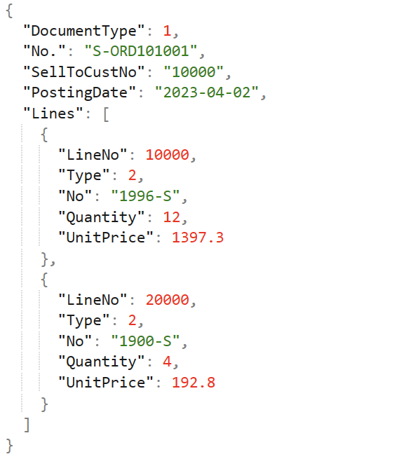
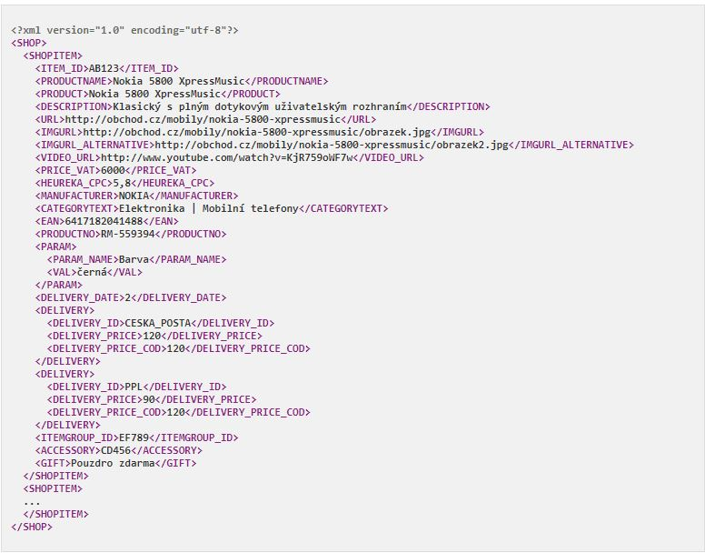
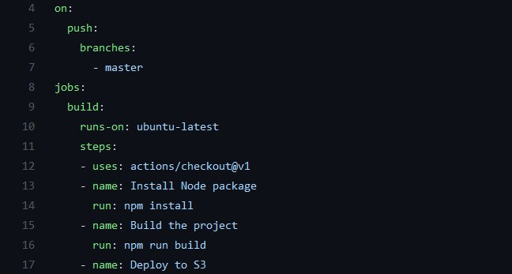

Soubory a serializace - Ukládání a načítání dat, formáty souborů
===

Povídání
---

Serializací se mohou myslet dvě věci. Buď lze myslet tu klasickou, tedy serializaci nějakého objektu do binárního formátu, nebo serializaci do nějakého textového formátu. Nejdříve se podíváme na tu první.                
Při programování mám tu možnost serializovat objekt a následně ho třeba znovupoužít v jiném kódu. Taková serializace probíhá do nějakého binárního formátu, kterému pak rozumí jen cílová knihovna. Pro zajímavost např. v Javě, když v souboru upravíme byť jediný charakter, kompletně ho narušíme.               
Takhle může vypadat serializace v Pythonu. Využijeme knihovnu pickle. Nejdříve třídu serializujeme:              

```Python
import pickle

class Serializable():
    
    def __init__(self, num):
        self.num = num

myobj = Serializable(10)

with open('myobj.pkl', mode="wb") as file:
    pickle.dump(myobj, file)
```

Následně ji můžeme opět načíst:

```Python
import pickle

class Serializable():
    
    def __init__(self, num):
        self.num = num

myobj = None

with open('myobj.pkl', mode='rb') as file:
    myobj = pickle.load(file)

print(myobj.num)
```

Obdobný proces lze udělat i v Javě. V Javě je nutné, aby třída implementovala rozhraní Serializable             
Nejdříve uložíme:

```Java
import java.io.FileNotFoundException;
import java.io.FileOutputStream;
import java.io.IOException;
import java.io.ObjectOutputStream;

public class Main {
    public static void main(String[] args) {
         try {
            MObject mObject = new MObject("Tvoje mama", 69);
            ObjectOutputStream out = new ObjectOutputStream(new FileOutputStream("myobject"));
            out.writeObject(mObject);
            out.close();
         } catch (FileNotFoundException e) {
            // TODO Auto-generated catch block
            e.printStackTrace();
         } catch (IOException e) {
            // TODO Auto-generated catch block
            e.printStackTrace();
         }
    } 
}

import java.io.Serializable;

public class MObject implements Serializable{

    public static int bigNumber = 5;
    private String message;
    private int number;
    
    public MObject(String message, int number){
        this.message = message;
        this.number = number;
    }

    public String getMessage() {
        return message;
    }

    public int getNumber() {
        return number;
    }

    @Override
    public String toString() {
        return message + ": " + number;
    }
}
```

Pak načteme:

```Java
import java.io.FileInputStream;
import java.io.FileNotFoundException;
import java.io.IOException;
import java.io.ObjectInputStream;

public class Main {
    public static void main(String[] args) {
         try {
            ObjectInputStream in = new ObjectInputStream(new FileInputStream("myobject"));
            MObject m = (MObject) in.readObject();
            System.out.println(m);

         } catch (FileNotFoundException e) {
            // TODO Auto-generated catch block
            e.printStackTrace();
         } catch (IOException e) {
            // TODO Auto-generated catch block
            e.printStackTrace();
         } catch (ClassNotFoundException e) {
            // TODO Auto-generated catch block
            e.printStackTrace();
        }
    } 
}
```

Nějaké důležité poznámky s serializaci. Statické proměnné nelze serializovat, náleží třídě ne instanci. V Javě můžeme udělat proměnnou *transient*. To znamená, že nebude serializována.

Podíváme se teď, jak lze zapisovat do textových souborů.                
V Pythonu je to jednoduché. Stačí nadefinovat, že chceme do souboru zapisovat a můžeme zapisovat. Neexistuje-li soubor, Python ho automaticky vytvoří. Přepínač "w" znamená *write*. Takže vždy soubor přepíše. Chceme-li do souboru přidat text, můžeme využít přepínač "a".           

```Python
with open('file.txt', 'wt') as file:
    file.write("Ahoooj")
```

V Javě je to trošku rafinovanější. Java využívá tzv. streams. Do textového souboru chceme zapisovat zpravidla po řádcích. To dovede např. BufferedStreamWriter nebo FileWriter (jsou stejné v podstatě). Příklad ukáže názorně:

```Java
import java.io.BufferedWriter;
import java.io.FileWriter;
import java.io.IOException;
import java.io.PrintWriter;

public class Main {
    public static void main(String[] args) {
        try {
            BufferedWriter writer = new BufferedWriter(new FileWriter("file.txt"));
            //PrintWriter writer = new PrintWriter("file.txt");        Taky moznost
            writer.write("Ahooj");
            writer.close();
        } catch (IOException e) {
            // TODO Auto-generated catch block
            e.printStackTrace();
        }
    } 
}
```

V Pythonu je načítání dat banální. Prostě místo "w" dáme "r".           
V Javě je to podobné, nicméně ne stejné. Využijeme jiný stream. Může to vypadat třeba takhle:

```Java
import java.io.BufferedReader;
import java.io.FileNotFoundException;
import java.io.FileReader;
import java.io.IOException;

public class Main {
    public static void main(String[] args) {
         try {
            BufferedReader bf = new BufferedReader(new FileReader("file.txt"));

            String line;

            while((line = bf.readLine()) != null){
               System.out.println(line);
            }
         } catch (FileNotFoundException e) {
            // TODO Auto-generated catch block
            e.printStackTrace();
         } catch (IOException e) {
            // TODO Auto-generated catch block
            e.printStackTrace();
         } 
    } 
}
```

Nuže, podíváme se nejdříve na jednolivé formáty souborů. Nebo alespoň na ty typické.           


První formát, který si ukážeme, je zároveň ten nejjednodušší a nejintuitivnější, CSV (Comma Separated Values). Jsou to zkrátka a dobře hodnoty oddělené čárkou. Nemusí to nutně být čárka, zpravidla to bývá třeba ještě středník. Teoreticky to může být jakýkoliv znak, který se nenachází nikde v našich datech.             
Běžně se první řádek ponechává na pojmenování sloupců.              
Práce s CSV souborem je velmi jednoduchá. Rozdělené řádky se dobře parsují na list. CSV soubory lze také jednoduše naimportovat do Excelu nebo do databáze.



Druhým jednoduchým formátem je JSON (Javascript Object Notation). Tento formát dovede velmi jednoduše uložit objekt. Dá se dobře parsovat do dictionary. Podporuje řadu datových typů, od objektů přes pole ke klasickým stringům a numberickým datovým typům.               
Já osobně ho mám nejraději, je dobře čitelný a dobře se s ním pracuje. Často se využívá u webových aplikací, prací s HTTP.



Dalším dříve hojně používaným formátem je XML (Extensible Markup Language). Vychází z podobné notace jako HTML. Má své výhody, jako třeba XML schéma. Nicméně osobně jsem s ním nijak extensivně nepracoval, tak maximálně v nějakém konfiguračním souboru, třeba Maven ho využívá.                      
Nevýhodou je, že kvůli nutnosti otevíracího a uzavíracího tagu u každého záznamu mohou být větší XML soubory skutečně větší.



Posledním, tentokrát velmi elegantním, formátem souboru, je YAML (YAML Aint Markup Language). Narozdíl od všech předchozích formátu aktivně využívá whitespaci, tedy neviditelné znaky, mezera, newline, ...                
Využívá ho např. Ansible nebo Docker-compose. V rámci serializace jsem s ním nikdy nepracoval, opět pouze jako konfigurační soubor nějaké externí aplikace.

Materiály
---

Coding with John - Java File Input/Output - It's Way Easier Than You Think - 