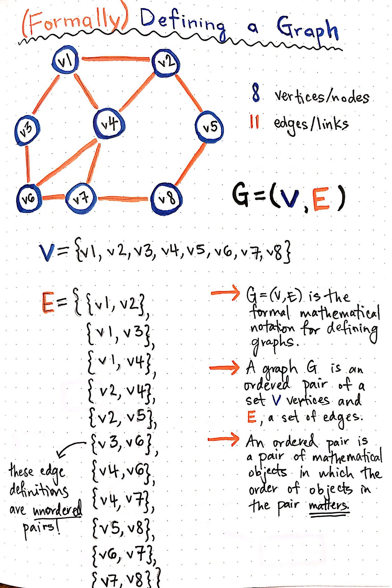
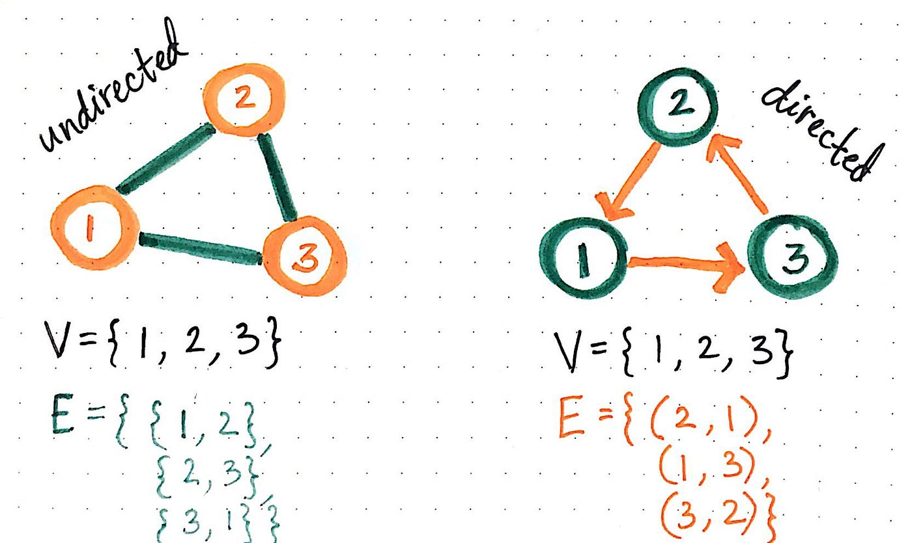
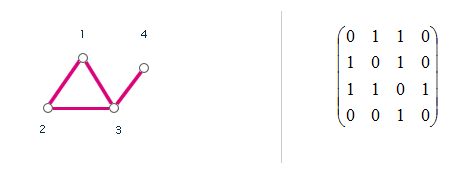
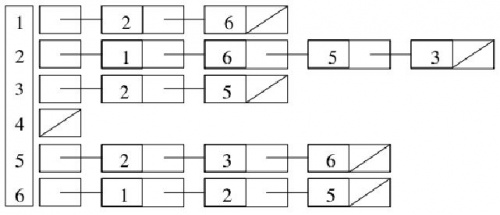
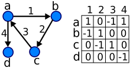
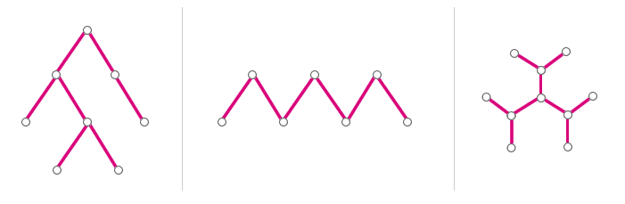
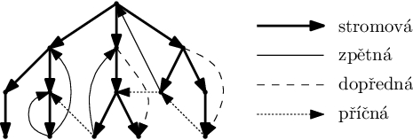
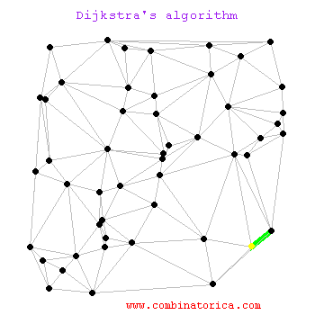

Algoritmizace - Grafy, Prohlédávání stavového prostoru, Řazení
===

Povídání
---

Začneme se základy teorie grafů. Nebudeme se zde věnovat matematické interpretaci, snad by nám měla stačit praktická představa k pochopení prohledávání a práci s grafy.                



V první řadě, grafy, o kterým budeme mluvit, nemají nic společného s grafy, jaké můžete znát např. z Excelu (fuj, Excel). Teorie grafů, přece jen se zde té matice úplně nevyhneme, definuje graf jako množinu vrcholů a hran. Ostatně to můžete vidět na obrázku výše. Každá hrana má právě dva vrcholy, vrchol může náležet libovolnému počtu hran (může stát i sám o sobě).              
Rozmyslel jsem si to, nakonec vám tu trochu té matematiky zařadím, ono se to bez toho úplně neobejde. Budete to muset vydržet.              
Graf je tedy formálně uspořádaná dvojice. Jedním prvkem je množina uzlů (vrcholů) a druhým množina hran. Že musí být množina vrcholů konečná a neprázdná by mělo být samozřejmé. Detaily k matematické definici najdete v knize Průvodce labyrintem algoritmů, na kterou se tu budu ostatně odkazovat velmi často, doporučuji přečíst.          
Zda označíme vrcholy číslem, písmenem, znakem, slovem, větou, tvarem, ... je čistě a jenom na náš. Nicméně nejšikovnější bývají písmena a čísla.



Graf může být buď orientovaný, nebo neorientovaný. Rozdíl? V případě neorientovaného grafu se množina hran skládá z neuspořádaných dvojic. V případě uspořádaného grafu jsou tyto dvojice uspořádané. Ízi ne? V praxi to znamená, že při pohybu v grafu nemůžeme putovat proti směru šipky.


Další tríček, který můžeme udělat, je dát hranám nějaké ohodnocení. K čemu je to dobré? Třeba ke hledání nejkratší cesty. Nemáme-li ohodnocené hrany, můžeme uvažovat, že každá hrana má hodnotu 1. To nám ale pro složitější problémy nestačí. Mějme spletici silnic. Uvažujme teď, že řidiči jsou slušní, ačkoliv je to velmi nereálná premisa. Na dálnici můžete jet až 130km/h. Kdyby do stejného místa naprosto stejným způsobem a terénem vedla i jiné silnice, která by nebyla nijak speciálně klasifikována, mohli bychom po ní jet 90km/h. V grafu by se to odrazilo tak, že z jednoho vrcholu povedou dvě hrany do druhého vrcholu. Pokud bychom měli neohodnocený graf, obě cesty by měly stejnou váhu, rozhodovací algoritmus by tedy vybral jednu z nich. My ale víme, že dálnice je rychlejší (za ideálních podmínek). Přednostního využití dálnice zařídíme právě tak, že hranám dáme nějakou váhu, třeba hodnoty 2 pro silnici a 1 pro dálnici. Prohledávací algoritmus tak upřednostní dálnici.            



Podíváme se teď, jak můžeme graf representovat např. v kódu nebo numericky. Jedním z možnosti je tzv. matice sousednosti. Můžete ji vidět na obrázku. Vytvoříme ji velmi jednoduše. Sloupce jsou vrcholy zprava doleva a řádky jsou vrcholy ve stejném pořadí jen ze shora dolů. Jednička značí, že vrchol s tím druhým sousedí. Z obrázku je vidět, že např. vrchol 2 sousedí s vrcholem 1, protože v průniku druhého sloupce a prvního řádku má jedničku. Stejnou informaci nám mimochodem sděluje i jednička v průniku prvního sloupce a druhého řádku.              
Z matice je velmi jednoduché rozpoznat, zda je graf orientovaný, či nikoliv. Neorientovaný graf bude vždy symetrický podle hlavní diagonály (z levého horního rohu do pravého dolního rohu). Když se nad tím zamyslíte, je to pěkně intuitivní. Když bod A sousedí s bodem B, musí nutně bod B sousedit i s bodem A.            
V orientovaném grafu ale tento předpoklad platit rozhodně nemusí. Můžeme-li se dostat z bodu A do bodu B, neplyne z toho, že z bodu B se můžeme dostat i do bodu A. Matice sousednosti tak může vypadat všerůzně.           
Když budu čerpat z Průvodce labyrintem algoritmů a ušetřím vám tak chvilku hledání, nalezení všech hran vedoucích z vrcholu trvá v matici sousednosti O(n), tedy má linární čas.            
V rámci prostoru, který v paměti zabere, je to trošku horší. Protože pro n řádků máme právě n sloupců, paměťová složitost bude O(n^2).          
Velkou výhodou matice sousednosti ale je, že v konstantním čase dovedeme zjisti, zda jsou dva vrcholy spojeny hranou. Stačí se podívat na patřičné místo v matici.



Dalším velmi jednoduchým způsobem zápisu grafu je list sousednosti. Můžeme ho vytvořit buď jako spojový seznam, nebo jak list o dvou prvcích, vrchol a seznam vrcholů, se kterými sousedí. Na obrázku je to vidět docela pěkně, konkrétně v implementaci pomocí spojového seznamu.          
Šikovná je také reprezentace pomocí dictionary, kde klíče jsou čísla vrcholů a hodnoty listy sousedů.           
Tato reprezentace má své značné výhody. Např. se rozhodně hodí více k reprezentaci tzv. řídkých grafů. Laicky řečeno grafů, která nemají přemnohé množství hran ku svému počtu vrcholů. Matice sousednosti pro takové grafy by byla zbytečně veliká.            
Reprezentace pomocí seznamu sousedů nám tedy značně šetří místo, pouze O(n + m).            
Vyjmenování hran je opět lineární, zde se změna nekoná.         
Co se ale zhoršilo, je zjišťování, zda jsou spolu nějaké dvě hrany spojeny. Musíme projít všechny sousedy v poli. Nicméně takové zhoršení je pro menší grafy zanedbatelné.



Posledním možnou reprezentací je matice incidence. Jak je vidět z obrázku nahoře, na místě sloupců máme hrany grafy a na místě řádků uzly. Matice popisuje, jaké uzly jsou spojeny jakou hranou. V každém sloupci tedy musí být právě dvě hodnoty odlišné od nuly, protože nemůže existovat hrana bez dvou uzlů. V případě neorientovaných grafů zde najdeme dvě jedničky, v případě orientovaných jedičku a mínus jedničku. Polopatě řečeno, jednička je u vrcholu, ze kterého šipka vychází, mínus jednička u uzly, do kterého míří.              
Nicméně jak tvrdí Průvodce, pro algoritmy se nehodí, protože dovede nabýt velmi velkých rozměrů. Je ale dobré ji znát.



Ještě než se vrhneme na prohledávání grafu, stojí za zmínku jeden speciální druh grafu, strom. Strom poznáme jednoduše, nemá cyklus. Tedy ke každému bodu grafu vede právě jedna cesta od každého jiného bodu. Na obrázku jsou příklady takových stromů.

Ukázali jsme si, co je to graf a jak ho lze jednoduše reprezentovat v kódu. Teď si ukážeme, jak se v grafu orientovat a jak ho prohledávat. Existují pro to dva základní algoritmy, které bychom měli znát.         
Prohledáváním se myslí procházení hran a vrcholů grafu od určitého vrcholu.


Prvním algoritmem je prohledávání do šířky, anglicky BFS (Breadth First Search). Zuksím ho tu nějak jednoduše vysvětlit. Prohledávání do šířky funguje následovně. Vybereme si uzel, z něhož chceme začít. Od tohoto uzlu prohledáme všechny sousedy, které si někam uložíme. Pak vezmeme první z těchto uložených bodů a provedeme pro něj to samé, tedy prohledáme všechny sousedy a uložíme je. Byl-li soused už prohledán, nebo uzavžen, znovu ho neukládáme. V podstatě postupuje jako taková vlna. Hezky je to vidět na obrázku výše.     
Časová složitost tohoto algoritmu je lineární, paměťová také. Takže nic hrozného. Logicky je závislá na počtu uzlů.             
Algrotimu BFS lze také využít při zjišťování spojitosti grafu. Prostě si vybereme nějaký bod a pokud jsme pomocí hledání do šířky navštívili všechny ostatní vrcholy, graf je spojitý. Pokud ne, graf spojitý není. Algoritmus, kterým lze získat popsané segmenty grafu, je-li nespojitý, můžeme najít v Průvodci.                 
Tak a teď to hlavní. Co vlastně tímto prohledáváním získáme? Prohledáváním do šířky lze zjistit především dvě věci. Za prvé, v závislosti na našem počátečním uzlu, můžeme vrcholy označit hloubkou na základě toho, jak dlouho jsme se k nim dostávali. Můžete si graf představit jako cibuli, má vrstvy.              
K čemu je to dobré? Můžeme tak odhadovat, jakou úlohu plní jednotlivé hrany v grafu. Víme-li třeba, že bod i a j tvoří hranu, můžeme v závisloti na tom, v jaké hloubce vůči sobě leží, říct, zda se jedná o hranu zpětnou (vede do některé z minulých vrstev), hranu příčnou (je v rámci stejné vrstvy), stromovou nebo dopřednou. Detaily k tomu, co které hrana znamená, si můžete buď odvodit, nebo najít. K maturitě snad takové detaily potřebovat nebudete.              
Druhým užitečným výstupem BFS je list nejkratších cest. Ten nám jednoduše říká, jak se nejkratší cestou dostat ke všem uzlům. Opět v závisloti na tom, co jsme zvolili jako uzel počáteční.         

Druhý algoritmus je DFS (Depth First Search), čili prohledávání do hloubky. Trochu to zrychlíme, podívejte se na gif, tam je velmi pěkně vidět, jak tento algoritmus postupuje, já si alespoň ušetřím popisování.               
DFS využívá ke svému fungování rekurzi. Otevře nějaký vrchol, začne rekurzivně prohledávat jeho následovníky. Paměťová a časová složitost je podobně jako u BFS lineární. V rámci časové složitosti závisí na počtu uzlů a hran. U paměťové potřebuje dost na pomocná pole a zásobník rekurze. Ano, v postatě jen parafrázuji Průvodce, ale kdo z vás se do něj opravdu plánuje podívat? Myslel jsem si to.      



Původně jsem se tomu chtěl vyhnout, ale vzhledem k tomu, že výsledkem algoritmu DFS je dvojice polí, díky kterým můžeme docela elegantně rozlišit typy jednotlivých hran, představíme si konkrétně, jak vypadají jednotlivé možnosti. V průběhu běhu algoritmu si zapisujeme, kdy jsme vrchol otevřeli a kdy jsme ho zavřeli. Když se pak podíváme na tyto dvě čísla, můžeme na základě jejich závisloti poznat, o jakou hranu se jedná.            
Pro ty, kteří mají raději abstraktnější představy. Můžete si představit otevření vrcholu jako zapsání levé strany závorky. Zavření vrcholu naopak jako uzavření závorky. Na základě toho, jak jsou vůči sobě závorky postaveny, můžeme obdobně rozhodnout, o kterou z hran se jedná.            
Algoritmus vždy vezme novou hrany, která vychází z aktuálního vrcholu. Vede-li tato hrana do nového vrcholu (tj. neobjeveného, fresh), nazýváme ji stromovou. Algoritmus pak postoupí dále do hloubky a novým aktuálním vrcholem se stane koncový vrchol této hrany. Algoritmus tedy takto vytvoří stromový graf s kořenem v našem počátečním vrcholu.  
Pokud by algoritmus vzal novou hranu, jejíž koncový vrchol by byl ve stavu open, algoritmus tuto hranu přeskočí. Nazýváme ji zpětnou hranou. Vede ve stromu směrem nazpátek.        
Dále může být vybraný vrchol další hrany ve stavu closed. Řekněme, že jsme si vrcholy označili čísly. Pokud vede tato hrana do vrcholy s vyšším číslem, než je to současné, jedná se o hranu tzv. dopřednou. Vede dál v téže větvi stromu. Pokud vede do vrcholu s nižším číslem, jedná se o hranu příčnou. Ta vede do vedlejší, již dříve opuštěné větvě stromu.           
Pro maturitu by vám měla stačit jen přibližná představa, popř. znalost implementace a fungování algoritmu. Další na řadě jsou algoritmy pro nalezení nejkratší cesty.



TEXT HERE

TEXT HERE


Ukázky kódu
---

Pozn.: Vysvětlení kódu bude zpravidla jen u jednoho z programovacích jazyků. Šetří mi to práci a všech jazyků bude vypadat algoritmus analogicky.

**Python - BFS**

```Python
G = {1: [2,4], 2:[3,5], 3: [6], 4: [3], 5: [3,6], 6: [7], 7: []}    # Nas graf reprezentovan listem sousedu. Je to orientovany neoceneny graf
D = dict()  # List vrstev
P = dict()  # List nejkratsich cest
not_found_vertices = [] # Nenalezene uzly
open_vertices = []  # Otevrene uzly
closed_vertices = []    # Uzavrene uzly

# Inicializace
for v in G.keys():
    not_found_vertices.append(v)    # Vsechny vrcholy oznacime jako nenalezene
    P[v] = []   # Inicializujeme list nejkratsi cesty pro kazdy vrchol

# Oznacime nas pocatecni vrchol jako otevreny
not_found_vertices.remove(1)    
open_vertices.append(1)

# Hloubka pocatecniho vrcholu je 0
D[1] = 0

# Dokud existuji otevrene vrcholy, prohledavame graf
while len(open_vertices) > 0:
    v = open_vertices.pop(0)    # Vezmeme dalsi otevreny vrchol z fronty    

    # Prohledame kazdy sousedni vrchol
    for w in G[v]:  
        
        # Pokud sousedni vrchol jeste nebyl nalezen provedeme
        if w in not_found_vertices:
            not_found_vertices.remove(w)    # Odstranime ho z nenalezenych vrcholu
            D[w] = D[v] + 1 # Zapisejeme jeho hloubku jako hloubku vrcholu, pres ktery jsme se k nemu dostali, plus jedna
            P[w] = [x for x in P[v]]    # Nejkratsi cesta se sklada ze vsech vrcholu, ktere jsme museli projit, abychom se dostali k sousednimu vrcholu, plus tento sousedni vrchol
            P[w].append(v)  # Zde pridame sousedni vrchol
            open_vertices.append(w) # Pridame vrchol do otevrenych vrcholu

    closed_vertices.append(v)   # Vsechny sousedni vrcholy byly prohledany, vrchol muzeme ulozit to uzavrenych vrcholu

# Vypiseme vysledky
print(D) 
print(P) 
```

**Python - DFS**

**Java - BFS**
**Java - DFS**

**C++ - BFS**
**C++ - DFS**

Materiály
---

Martin Mareš a Tomáš Valla - Průvodce labyrintem algoritmů - https://pruvodce.ucw.cz/static/pruvodce.pdf            
- **Kapitola 3** Třídění
- **Kapitola 5** Základní grafové algoritmy
- **Kapitola 6** Nejkratší cesty
- **Dodatek A** Základy teorie grafů

Reducible - Introduction to Graph Theory: A computer science perspective - https://inv.nadeko.net/watch?v=LFKZLXVO-Dg     

Reducible - Depth First Search (DFS) Explained - https://inv.nadeko.net/watch?v=PMMc4VsIacU
Wikipedia - Prohledavani do hloubky - https://cs.wikipedia.org/wiki/Prohled%C3%A1v%C3%A1n%C3%AD_do_hloubky               
Reducible - Breadth First Search (BFS) Explained - https://inv.nadeko.net/watch?v=xlVX7dXLS64&listen=false          
Michael Sambol - Dijkstra's Algorithm in 3 minutes - https://inv.nadeko.net/watch?v=_lHSawdgXpI         
Computerphile - A Star Search Algorithm - https://inv.nadeko.net/watch?v=ySN5Wnu88nE            

Michael Sambol - Bubble Sort in 2 minutes - https://inv.nadeko.net/watch?v=xli_FI7CuzA          
Michael Sambol - Selection Sort in 3 minutes - https://inv.nadeko.net/watch?v=g-PGLbMth_g&listen=false          
Michael Sambol - Insertion Sort in 2 minutes - https://inv.nadeko.net/watch?v=JU767SDMDvA&listen=false          
Michael Sambol - Quick Sort in 4 minutes - https://inv.nadeko.net/watch?v=Hoixgm4-P4M&listen=false              
Michael Sambol - Merge Sort in 3 minutes - https://inv.nadeko.net/watch?v=4VqmGXwpLqc&listen=false      