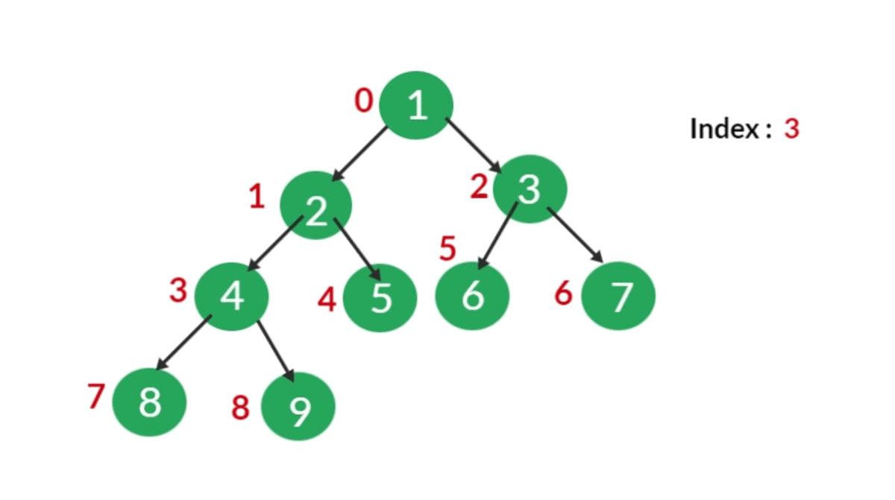

Typy datových struktur - Pole, Spojový seznam, Strom, Fronta, Zásobník, Halda
===

Povídání
---

Podíváme se teď na různé datové struktury. U každé si uděláme jednoduchý popis a běžné použití.                 


Začneme u té nejjednodušší, u pole. Prozatím budeme chápat pouze statické pole, tedy pole o přesně daném počtu prvků. Prvky by také měly být stejně veliké, aby se polem dalo dobře procházet. O poli jsme si už hodně řekli v předchozích otázkách, tak jen pro rekapitulaci.              
Např. v jazyce C je pole reprezentováno pouze jako ukazatel na první prvek pole. V poli se posunujeme pomocí inkrementace či dekrementace indexu o přesně danou hodnotu (velikost jednoho prvku). Už to nám napoví, že se jedná o indexovanou strukturu. K prvkům v poli tedy přistupujeme pomocí indexu, čísla, které reprezentuje pozici prvku od začátku pole. Pole bývá zpravidla indexováno od 0, nicméně v některých jazycích se jako první index využívá 1. Velkou výhodou klasického pole tedy je, že přístup k prvkům je v čase O(1), tedy konstantní, zpravidla v podstatě ihned.               
Statické pole v paměti zaplní tolik místa, kolik má prvků, naprosto nečekaně. Pro své fungování musí být v paměti také spojité, to znamená, že potřebuje v paměti spojité volné místo o velikosti pole, jinak ho nebude možné vytvořit. Což nemusí vždy být reálné, především máme-li hodně naplněnou paměť.                             
Nic nám nebrání vytvářet také vícerozměrné pole, to může reprezentovat třeba nějakou matici. Indexování zde funguje stejně, jen potřebujeme indexů tolik, kolik dimenzí pole jsme vytvořili.                
Můžeme mít i pole dynamické, tedy proměnné délky. V paměti je to ale stále pokaždé to samé spojité pole, nicméně interní logika dynamického pole při přidání nového prvku, který by se do pole už nevešel, udělá to, že najde větší místo v paměti a tam udělá větší pole a nakopíruje do něj stávající hodnoty společně s novou přidanou.          
Ukážeme si teď příklad pole v Javě. Lze vytvořit klasické pole, které má pevně definovanou velikost, pomocí hranatých závorek. Nebo lze vytvořit dynamické pole pomocí objektu ArrayList.               

```Java
import java.util.ArrayList;

public class Main{

    public static void main(String[] args) {
        int arr[] = new int[10];
        ArrayList<Integer> dynamic = new ArrayList<Integer>();

        for(int i = 0; i < 10; i++){
            arr[i] = i;
            dynamic.add(i);
        }
        
        System.out.println("This is our array:");
        for(int i : arr){
            System.err.print(i + ',');
        }
        System.err.println();

        System.out.println("This is our ArrayList: ");
        System.err.println(dynamic);
    }
}
```     


Další oblíbenou datovou strukturou je spojový seznam. Víme, že abychom mohli vytvořit pole, potřebujeme spojité místo v paměti. No a co když ho nemáme? Tento problém elegantně řeší právě spojový seznam.                  
Spojový seznam se neskládá z prvků samotných, ale z jakýchsi nodů. Každý node má v sobě uloženou hodnotu a ukazatel na další node. První node se zpravidla označuje jako Head. Poslední node má v ukazateli uloženou hodnotu NULL, tedy již neukazuje na žádný další prvek.                 
Spojový seznam může být jednosměrný, nebo obousměrný. V případě obousměrného spojového seznamu ukládáme ještě hodotu tail, konec seznamu, a u každého nodu máme ještě hodnotu previous, tedy předchozí prvek. Obousměrný spojový seznam např. zrychluje vyhledávání. Na rozdíl a využítí těchto dvou typů spojového seznamu se podíváme záhy.               
Spojový seznam tedy má své značné výhody, nicméně má i své nevýhody. Např. chceme-li k nějakému prvku přistoupit, nelze to udělat v konstantním čase, nýbrž v čase lineárním. Musíme se k prvku nejdříve dostat skrz všechny předchozí. Což není ideální.               
Spojový seznam napsaný v Javě může vypadat nějak takhle:                

```Java
public class Main{

    public static void main(String[] args) {
        MyLinkedList<Integer> lst = new MyLinkedList<Integer>();
        lst.push(2);
        lst.push(7);
        lst.push(5);

        for(Integer i : lst){
            System.out.println(i);
        }
    }
}

public class Node<T> {
    private Node next;
    private T value;
    
    public Node(Node next, T value){
        this.next = next;
        this.value = value;
    }

    public Node getNext() {
        return next;
    }

    public void setNext(Node next) {
        this.next = next;
    }

    public T getValue() {
        return value;
    }

    public void setValue(T value) {
        this.value = value;
    }
}
    
import java.util.Iterator;

public class MyLinkedList<T> implements Iterable<T>{
    
    private Node head;
    
    public MyLinkedList(){
        this.head = null;
    }

    public void push(T value){
        if(head == null){
            head = new Node<T>(null, value);
        } else {
            Node newNode = new Node<T>(head, value);
            head = newNode;
        }
    }

    public T pop(){
        if(head == null){
            return null;
        }
        Node temp = head;
        head = head.getNext();
        return (T) temp.getValue();
    }

    @Override
    public Iterator<T> iterator() {
        return new Iterator<T>() {

            Node node = head;

            @Override
            public boolean hasNext() {
                if(node == null){
                    return false;
                }
                return true;
            }

            @Override
            public T next() {
                T next = (T) node.getValue();
                node = node.getNext();
                return next;
            }
            
        };
    }
}
```

Tento konkrétně je jednosměrný, je to tedy příklad tzv. zásobníku.


Zásobník je velmi jednoduché datová struktura, která dovoluje přidávat prvky na svých vrch a odebírat je opět jen ze stejného místa. Analogicky se často přirovnává ke štosu knížek. Nemůžete vzít knížku uprostřed, protože by vám celý štos spadl.         
V realitě je to malinko jiné, s prvky uprostřed můžete libovolně pracovat, nicméně je zpravidla neodstraníte. Typicky totiž stack implementuje dvě metody: push a pop.          
Metoda push() přidá prvek na vrchol. Metoda pop() ho z vrcholu sejme a vrátí. Nic nám ale nebrání implementovat pohyb v zásobníku a možnost přístupu i k prvků, které jsou vespod.              
Realita je takové, že zásobník není zrovna moc exkluzivní datová struktura, protože ho lze implementovat jako jednosměrný spojový seznam. Head je vrchol stacku. Takováto implementace je velmi jednoduché na práci a vytvoření a funguje tak, jak by měl stack v teorii fungovat.                  
Zásobník nachází své praktické uplatnění např. v paměti, kde existuje třeba takový call stack, tedy zásobník metod a funkcí, které voláme.                  


Další z datavých struktur, které se odvijí od spojového seznamu, je fronta. Fronta je přesně to, co si představíte, je to fronta prvků. Prvky můžeme přidávat zezadu a odebírat zpředu fronty.              
V realitě fronta není nic jiného než obousměrný spojový seznam.             
Reálné využití fronty lze najít na spoustě míst. My si zmíníme třeba frontu procesů, ze kterých vybírá scheduler operačního systému.


Strom. Opět se nejedná o nic jiného, než o spojový seznam, jen tentokrát trochu speciální. Každý další node má seznam nodů, na které odkazuje. Pokud je počet těchto nodů maximálně dva, jedná se o binární strom.                  
Můžeme jím reprezentovat třeba dialog ve hře, popř. nějaký rozhodovací strom.               


Poslední, tak docela speciální datovou stukturou, je halda. Halda je speciální typ binárního stromu.                
Na obrázku se nejlépe popíše princip haldy. Každý node může mít buď pouze levý dceřiný node, dva nody, nebo žádný.             
Rozlišujeme dva základní typy haldy. Min-Heap a Max-Heap. U min haldy platí vždy tato podmínka: Hodnoty dceřiných nodů musí být větší, nebo rovny hodnotě daného nodu. Na vrchu, u kořene, bude tedy vždy nejnižší hodnota v haldě. U max heapu to funguje obdobně jen obráceně.    


U haldy provádíme dva základní operace. Vklad nového prvku a odstranění prvku u kořene. Vklad prvku je trochu složitý. Zkusíme si to trochu rozebrat. Co víme? Je povoleno, aby node měl jen jeden dceřiný node, a to právě vlevo. Také víme, že nejmenší/nejvetší hodnota, musí být vždy nahoře, tedy směrem ke kořeni haldy jsou prvky čím dál tím menší/větší.               
Nuže vklad nového prvku tedy vypadá asi nějak takto: Vytvoříme nový node, a to vždy tak, abychom zaplňovali haldu plus minus rovnoměrně. Začínáme tedy nejdříve plnit levé dceřiné nody poslední řady. Lépe než já to popíše gif nebo video.            
Nasledně ale můsíme zařídit, že je prvek na správném místě a platí vždy pravidlo, které jsme si na začátku nastavili. To uděláme tzv. probubláním prvku. Např. v případě min haldy to bude vypadat asi tak, že se vždy podíváme, zda prvek nahoře náhodou není větší. Pokud je, vymění si s ním nový prvek místo a tak dokud se nedostatne na svou pozici.          



Druhou oprací je odebrání prvku z vrchu haldy. To je v podstatě dosti podobné. Vezmeme nejdříve prvek, který je na vrchu haldy, odstraníme ho a vrátíme ho. Pak najdeme prvek na spodu haldy, který dáme nahoru místo našeho odstraněného prvku.                
Tento prvek nemůžeme vybrat náhodně, musíme zachovat strukturu haldy. Vybíráme tedy prvek tak, abychom zachovali rovnost spodní části haldy. Důležitou informací je, že v levém křídle haldy může být o prvek více.                 
Následně musíme opět zaručit, že platí naše podmínka, takže vrchní prvek, obodobně, jako jsme to dělali u přidávání, necháme probublat na jeho místo. Např. u min haldy do provedeme tak, že vždy vezmeme menší ze dvou dceřiných nodů a ten prohodíme s našim novým kořenovým nodem. Samozřejmě pod podmínkou, že oba nody jsou menší než náš nový kořenový node.

Materiály
---