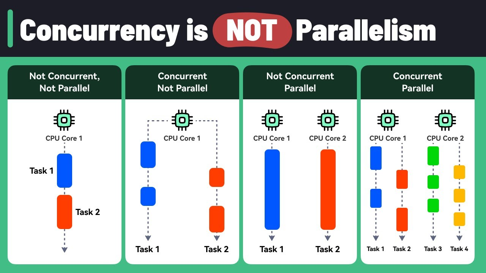
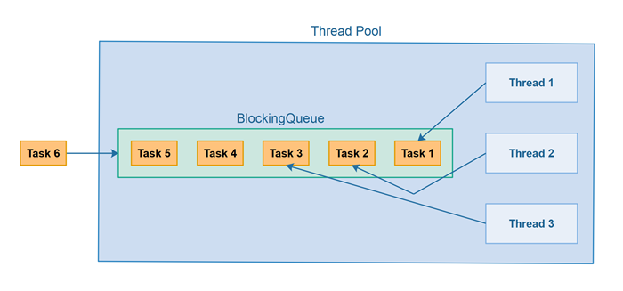

Vlákna, Paralelní programování, Asynchronní metody, Concurrent design patterns
===

Povídání
---

Chceme-li zrychlit běh naší aplikace, často musíme přistoupit k něčemu, čemu se říká paralelní programování. Když běží něco paralelní, běží to tzv. současně. V paralelním programování tedy běží současně nějaké procesy nebo vlákna. Paralelní programování nám ale zpravidla přináší také nespočet složitých problémů. Na ty se brzy podíváme, nejdříve se ale podíváme, jak toto paralelní programování využít, resp. jak napsat program, který využívá více procesů či vláken.             
Začneme více procesy, to je možná trochu intuitivnější. Dobře se to demonstruje na procesu v Linuxu. Každý proces má svou strukturu. Plánovač rozhoduje, kdy poběží. Žije si zkrátka svým životem. Má svůj stack i heap. V Linuxu byl historicky vytvořen tak, že byl nejdříve vytvořen klon původního procesu (na chlup stejný proces) pomocí metody fork(). Následně mu byl nahrán jiný kód jedním z příkazů exec().                  
U maturity ale Linux k dispozici nejspíš nebude, takže tuto demonstraci záměrně zanedbám. Ukážeme si, jak lze proces vytvořit např. v Pythonu. Pomůže nám k tomu knihovna multiprocessing. Spuštění nového procesu znamená spuštění nové instance Python interpreteru. Zkrátka jako kdybychom spustili další kompletně nový skript. Důležité je si uvědomit, že nový proces má **svou haldu**.

```Python
from multiprocessing import Process
import os

def very_hard_computational_task(greetings):
    print(f"{greetings}, I am working very hard\nThis is my pid {os.getpid()}")

if __name__ == '__main__':
    new_process = Process(target=very_hard_computational_task, args=["Hello"])

    new_process.start()

    new_process.join()

    print(f"Hi there, I do nothing.\nThis is my pid: {os.getpid()}")
```

Na vidlích je velmi důležité *if \__name__ == '\__main__':*. Bez něj totiž nedovolí nový process spustit. Každý proces je unikátně identifikován svým pidem. Vidíme, že pidy jsou jiné, takže i procesy, které tuto metodu volaly, jsou rozdílné. Metoda *join()* je blokující metodou, která donutí volající proces čekat na skončení volaného procesu.                    
Co je ale často mnohem oblíbenější než vytvářet nové procesy je vytvářet nová vlákna. Co je to vlákno? Nu, najdete spoustu obrázků kolečka, ve kterém jsou vlákna. To vám toho ale moc neřekne. Takto, vlákno je něco jako další proces. Linux konkrétně s ním zachází naprosto totožně jako s novým procesem, Vidle mají snad vlastní plánovač pro vlákna.                 
Pro kontext, plánovač je program v operačním systému, který je zodpovědný za plánování běhu procesů.            
Co je ale u vláken důležité je fakt, že mají sdílenou haldu. Každé vlákno má ale svůj vlastní stack. Ukážeme si vytváření vláken, je velmi podobné vytváření procesů, nicméně vláknům se pověnujeme trochu více.            

```Python
from threading import Thread
import os

def very_hard_computational_task(greetings):
    print(f"{greetings}, I am working very hard\nThis is my pid {os.getpid()}")

if __name__ == '__main__':
    thread = Thread(target=very_hard_computational_task, args=['Hello'])

    thread.start()

    thread.join()

    print(f"Hello from the main thread: {os.getpid()}") 
```

Můžete si všimnout, že PID je stejný. Důvod proč může být závislý na operačním systému. Možná pro vás dokonce toto tvrzení neplatí a máte PID rozdílný. V Linuxu by nové vlákno mělo být nový proces, takže PID by měl být jiný. Nicméně všchny vlákna mají společní TGID (Thread Group ID). To je zpravidla PID původního procesu.                     
V Pythonu je to s vlákny trochu složitější. Abychom to pochopili, musíme si vysvětlit rozdíl mezi konkurencí a paralelním programováním. Konkurentní je, když se více procesů střída na jednom procesorovém jádře. Nikdy neprobíhají dvě věci najednou, nicméně to tak vypadá.          
Paralelní je, když probíhají dva různé procesy na dvou různých procesorových jádrech. Velmi hezky to popisuje tento obrázek.



Vlákna v Pythonu běží pouze konkuretně. Je to kvůli něčemu, čemu se říká GIL (GLobal Interpreter Lock). Tento mechanismus dovoluje, aby byl v jednu chvíli interpretován pouze jeden proces. Proč bychom něco takového chtěli? Python pro každý objekt ukládá jeho reference count, tedy počet referencí na něj. Když tento počet klesne na nulu, objekt je uklizen. Pro ilustraci:     

```Python
import sys

if __name__ == '__main__':
    l = []
    b = l
    new_list = [l, 1, "hello"]

    print(sys.getrefcount(l))
```

Vypíše se nám číslo 4. Proč 4? První reference je proměnná *l*. Druhá reference je proměnná *b*, ta totiž ukazuje na to samé pole. Třetí reference se nachází v listu *new_list*. A co ta čtvrtá? Tu jsme vytvořili při volání metody *getrefcount()*. Ukážeme si teď, co to znamená sdílená halda. Pak opravdu pochopíme, proč Python implementuje GIL. Když před vytvořením nového vlákna vytvoříme objekt na haldě, druhé vlákno ho uvidí, protože sdílí haldu s původním vláknem (ano, i proces o jednom vláknu je vlákno). To je mimo jiné i možnost, jak mezi vlákny komunikovat. Podívejte se sami:

```Python
import sys
import threading

if __name__ == "__main__":
    shared_list = ["Hello from shared list"]

    t1 = threading.Thread(target=lambda: shared_list.append("Hello from another thread"))

    t1.start()

    t1.join()

    for item in shared_list:
        print(item)
```

Pole je uloženo na haldě. Přidali jsme do něj prvek v našem vytvořeném vlákně a následně si tento prvek vypsali v tom původním. Dobře, objekty mají reference counter, objekty jsou v Pythonu na haldě, vlákna sdílejí haldu. Co by se mohlo posrat? Hodně by se toho mohlo podělat. V první řadě máme něco, čemu se říká race condition. Ta nastane, když se dva procesy snaží pracovat najednou s nějakým objektem, proměnnou. Detaily záleží na implementaci, nicméně zkrátka a dobře tak trochu závodí, kdo to stihne dřív. Kdybychom měli paralení vlákna v Pythonu, mohlo by se stát, že jedno vlákno by chtělo snížit reference na nula, druhá naopak jednu referenci přidat. A teď co? No, těžko říct. Můžeme skončit s číslem 2 a jednou referencí doopravdy. S číslem 0 a nový ukazatel bude místo na objekt ukazovat kamsi na haldě a v případě dalšího využití nejspíše OS zpozorní a celý proces raději zabije. Zkrátka a dobře by v tom byl nesmírný čurbes. Proto má Python raději GIL.                  
Když už jsme začali s problémy paralelního programování, můžeme pokračovat. Dalším známým problémem je tzv. deadlock. Ten může nastat třeba tak, že jedno vlákno drží jednu proměnnou, druhé drží druhou. Nicméně to první by chtělo přistoupit k té druhé a to druhé k té první. Ve finále ale ani jedno nebude mít nic a zaseknou se donekonečna, protože ani jedno tu svou proměnnou nepustí. Proto deadlock. Ačkoliv existují řešení Deadlocku, zpravidla mají velmi solidní nevýhody. Konvenční operační systémy to tedy řeší jednodušše. Vzhledem k tomu, že deadlock je v praxi docela vzácný, ignorojí fakt, že může nastat. Při nejhorším procesy jen zabijí a znovu spustí a jede se dál.                     
Dalším problémem, který může nastat, je tzv. starvation/vyhladovění. Moderní plánovače přidělují procesům priority. Procesy s vyšší prioritou běží častěji. Starvation může nastat, když se proces s menší prioritou nedovede dostat ke zdroji, který potřebuje, protože proces s prioritou větší si ji neustále nárokuje. Hezky příklad je jeden starý OS, kde bylo možné nastavit procesu vyšší prioritou, než mají systémové procesy. Tím jste si efektivně zabili počítač, protože žádný systémový proces, včetně toho, který by dovedl váš proces zabít, už nikdy běžet nemohl. Moderní OS tento problém řeší tak, že procesům dynamicky snižují a zvyšují prioritu.                   
U plánovače ještě chvilku zůstaneme a vysvětlíme si na něm rozdíl mezi kooperativním a preemptivním multitaskingem. Kooperativní multitasking byl populární kdysi. Je založen na principu, kde proces, který aktuálně běží, rozhoduje o tom, kdy pustí další proces. Proto kooperativní. Může mít své výhody a lze ho aplikovat i jinde než v systémovém plánovači. Když víme, co děláme, můžeme z něj dokonce benefitovat. Nicméně asi vydíme problém. Co když proces nikdy žádný další nepustí? Tak máme prostě smůlu.                
Moderní plánovače proto využívají tzv. preemptivní multitasking. To je typ multitaskingu, kde samotný plánovač rozhoduje, kdy jaký proces poběží.                   
Vrátíme se trochu zpátky, k race conditions. Jak jim zabránit? Pomocí tzv. konkurentních design patternů. Prvním z nich, je tzv. binární zámek/mutex. Ten může nabývat dvou stavů, zamčený a odemčený. Můžeme pomocí něj zamknout nějaký zdroj. Proces, který k němu přistoupí jako první ho zamkne. Dokud ho zase neodemkne, ostatní procesy mají smůlu. Když k takovému zdroji budou chtít přistoupit, zablokují se, dokud k němu nebudou vpuštěni, tj. původní proces mutex odemkne. Ukážeme si příklad v Pythonu:

```Python
import sys
import threading

shared_number = 10
mutex_lock = threading.Lock()

def add_to_number():
    global shared_number

    mutex_lock.acquire()

    for i in range(10000):
        shared_number += 1
    print("The second thread has finished counting")

    mutex_lock.release()

t1 = threading.Thread(target=add_to_number)

mutex_lock.acquire()

t1.start()

for i in range(10000):
    shared_number += 1

print("The first thread has finished counting, unlocking resources")

mutex_lock.release()

t1.join()

print(shared_number)
```

GIL v Pythonu brání vzniku race condition. Tak jsem to tímto příkladem malinko ochcal, aby bylo vidět, že zamkneme-li mutex, další vlákno začne přičítat až potom, co to první mutex uvolní. Metoda acquire je tudíž blokující, vlákno se na ní zasekne, dokud druhé vlákno mutex nepustí.
Ve kvalitnějších jazycích, jakým je třeba Java, jsou tyto problémy řešeny mnohem elegantněji klíčovými slovy. U této příležitosti si také ukážeme, jak se vytváří nové vlákno v Javě. Java ale narozdíl od Pythonu GIL nemá, pod pláštíkem zkrátka funguje trochu jinak. Její vlákna tedy běží plně paraleleně.

```Java
public class Main{

    public static void main(String[] args) {
        BigTask bigTask = new BigTask();
        Thread t1 = new Thread(bigTask);
        Thread t2 = new Thread(bigTask);
        try{
            t1.start();
            t2.start();

            t1.join();
            t2.join();

            System.out.println("This is our number: " + BigTask.k);
        } catch (Exception e){
            
        }
    }
}

public class BigTask implements Runnable{

    public static int k = 10;

    @Override
    public void run() {
        for(int i = 0; i < 10000; i++){
            k++;
        } 
    }
    
}
```

V javě máme dvě možnosti vytvoření nového vlákna. Oddědit třídu od třídy Thread, nebo implementovat interface Runnable. Můžeme si všimnout, že ve výše napsaném kódu vzniknou race conditions. Pokaždé nám vrátí jiné číslo. Paralelní vlákna se zkrátka neumí domluvit. Poupravíme teď tento kód tak, aby fungoval správně pomocí mutexového zámku.

```Java
public class Main{

    public static void main(String[] args) {
        BigTask bigTask = new BigTask();
        Thread t1 = new Thread(bigTask);
        Thread t2 = new Thread(bigTask);
        try{
            t1.start();
            t2.start();

            t1.join();
            t2.join();

            System.out.println("This is our number: " + BigTask.k);
        } catch (Exception e){
            
        }
    }
}

public class BigTask implements Runnable{

    public static  int k = 10;
    Object mutex = new Object();

    @Override
    public void run() {
        for(int i = 0; i < 10000; i++){
            synchronized(mutex){ 
                k++;
            }
        } 
    }
    
}
```

V javě to funguje trochu jinak, máme zde slovíčko *synchornized*. To dovede synchronizovat buď metodu, tedy ji zabezpečit mutexovým lockem, nebo nějaký block kódu. K zabezpečení bloku kódu je potřeba nějaký objekt, který bude jako mutex fungovat. Jak to funguje? Nu, alespoň co jsem se dočetl já, Java to má implementované tak, že každý objekt má v sobě lock. Takže můžeme použít libovolný objekt.           
Takto vypadá využití binárního semaforu (mutexu) v C++:

```C++
#include <iostream>
#include <thread>
#include <mutex>

using namespace std;

mutex m;
int i = 0;

void call()
{
    m.lock();

    cout << i << " Hi there" << endl;
    i++;
    
    m.unlock();
}

int main(){

    thread t1(call);
    thread t2(call);

    t1.join();
    t2.join();

    return 0;
}
```

Existují ještě další dva paterny pro synchronizaci, semafor a monitor. Semafor je velmi podobný mutexu, mutex je vlastně jen binární semafor. Má však jeden zásadní rozdíl. Ke zdroji, který je chráněný mutexem, může přistoupit pouze jedno vlákno. Semafor dovoluje nastavit, kolik vláken může danou operaci provádět v jednu chvíli. Má tedy interní counter, každé další vlákno ho při přístupu sníží. Když se dostane na nulu, další přistupující vlákno se zasekne a čeká. Lze tímto způsobem třeba limitovat zdroje.               
Monitor je trochu sporný. Podle učebnic by to měla být v podstatě abstraktní implementace mutexového locku. Jo, nic vám to neříká, mně také ne. V praxi záleží na programovacím jazyce. Třeba Java říká monitor zámku, který má každý objekt. Monitor je tam tedy v podstatě roven binárnímu semaforu. Zkuste zabrouzdat do literatury, zajímá-li vás to.                   
Poslední, o čem si povíme, jsou asynchronní metody. Co znamená, že něco běží asynchronně? Nejlépe to uvedeme na příkladu. Máme nějakou dlouhou funkci a nechceme v našem kódu čekat, než doběhne. Voláme ji třeba v nějakém zaneprázdněném odbavovacím loopu, nebo nám nevadí, že její výsledek přijde až později. Uložíme ho tedy typicky do nějakého slibu. To je datová struktura, která, jakmile fce skončí, uloží její výsledek. Typicky jakmile potřebujeme tento výsledek, můžeme si o něj říct. Když ještě není, metoda je blokující a kód se nám sekne, dokud asynchronní metoda nevrátí.                  
Asynchronní metody se hojně využívají např. v Pythonu, v Javascriptu, ale i ve všech ostatních jazycích. V podstatě je to nějaká procedura, která se spustí tak trochu bokem. Nebudu na to zde mít příklad, nicméně můžete se sami podívat na Async/Await třeba v Pythonu.                  
Poslední věc, kterou zmíním, je návrhový vzor ThreadPool. To je specifický návrhový vzor, který se využívá u paralelního programování. Je to konstrukt, který má k dispozici několik vláken a frontu úkolů. Lze submitovat úkoly a vlákna si je postupně rozebírají a plní.



Materiály
---
Realpython - GIL - https://realpython.com/python-gil/           
