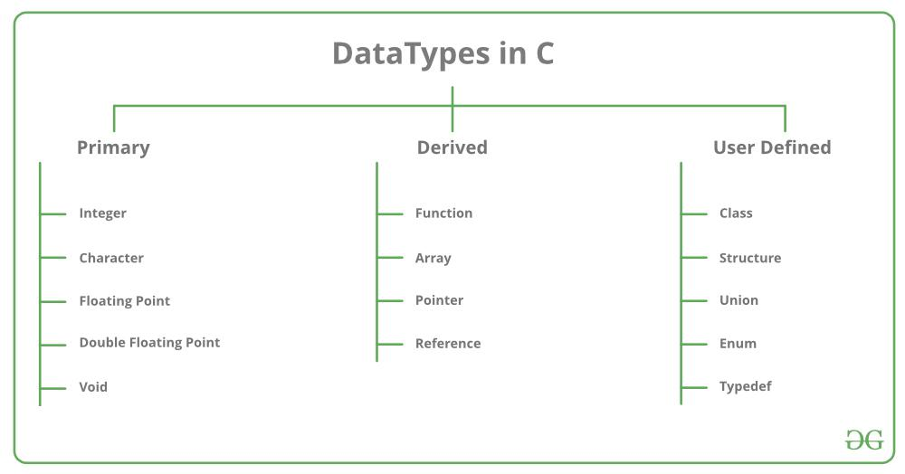

Datové typy, Generika, Výčtové datové typy, Struktury, Anotace, Operátory
===

Povídání
---



Datové typy. Podstatu datového typu si ukážeme na jednoduchém příkladu. Když vám tu napíši toto: **01100001**, dovede odhadnout, co to znamená? Dobře, ještě trochu upřesním. Tohle bude binární hodnota v jedné paměťové buňce. Co tu je za hodnotu? Je to číslo? Nebo část většího číslo? Ukazatel? Znak?. To nevíme, může to být cokoliv si zamaneme. Dokud tomu nedáme jasný datový typ.            
Datové typy nám tedy říkají, jak se máme k daným datům chovat, jak je máme interpretovat. Označíme-li tedy naše číslo jako INT, bude jeho hodnota 97. Oznáčíme-li ho jako CHAR, bude jeho hodnota písmeno 'a'. Pokud kódujeme podle ASCII, kódováním se v této otázce nebudeme hlouběji zabývat.            
Datových typů existuje spousta a každý programovací jazyk s nimi může zacházet mírně odlišně. Ku příkladu jazyk C má sice datový typ *char*, nicméně ten, místo aby nutně určoval, že hodnota je znak, udává jen číslo ve velikosti jednoho bytu. Zda ho budeme interpretovat jako číslo nebo ne, nechává na nás. Jiné jazyky ale nemusí být ve své interpretaci tak volné.             
Na obrázku nahoře máte docela hezký výpis různých datových typů, asi netřeba je všechny rozebírat. Podíváme se jen na nějaké zajímavé.              
Asi nejzajímavějším a přitom jedním z nejběžnějších datových typů je STRING, textový řetězec. Každý programovací jazyk si s ním hraje jinak. V jazyce C není STRING nic víc než pole charů ukončené null terminátorem. Když se podíváme ještě více do hloubky, proměnná, kterou dostaneme po vytvoření STRINGU nebo jiného libovolného pole, není nic jiného, než pointer na první prvek pole. Víme, jak velký je jeden prvek pole a jak je pole dlouhé, takže se v něm můžeme libovolně pohybovat pomocí přičítání a odčítání čísel k ukazateli.           

Nu, ale co když nevíme, jaký datový typ chceme využít? Na pomoc nám přichází generika. V jazyku C bohužel nic takového nemáma, ale např. Java nám je nabízí. Řekněme, že si opět vytváříme vlastní zásobník a chtěli bychom do něj ukládat více různých datových typů. Nu, ve třídě tedy budeme pracovat s nějakým generikem, typicky označováným T. Když pak object deklarujeme, místo generika vložíme datový typ, který chceme ukládat. Jednoduché, že?              

Existuje také něco, čemu zde pan ředitel fancy názvem říká výčtové datové typy. My lidi tomu budeme říkat enum. Enum se využívá, máme-li několik pevně daných neměnných hodnot, ze kterých chceme vybírat. Třeba dny v týdnu, měsíce, ... Každá hodnota je v realitě jenom číslo. To nás ale nemusí zajímat, my jen potřebujeme mezi těmito hodnotami rozlišovat.               

Struktury. Upřímně, nechápu, proč přesně je tady tento specifický .. datový typ? zařazen. Lze ho smysluplně využít v postatě jen v programovacích jazycík jako C nebo C++ a i tam už byl v postatě nahrazen třídami.            
Struktura není nic jiného, než že namrdáme několik datových typů do paměti za sebou a pak k nim můžeme přistupovat pomocí tečky a jména datového typu v dané struktuře. Ano, opravdu, to je všechno. Struktura se dovede chovat jako třída. Protože, fanfáry, funkce je také datový typ. Můžeme tedy vytvořit strukturu, která bude mít nějaké proměnné, vlastnosti, a nějaké funkce, metody.           

Anotace. Dobře, no, jediný programovací jazyk, ve kterém jsem kdy s anotacemi pracoval, je Java. Jestli to umí i nějaký jiný, nevím, možná ostré cé, ale v tom mi tu neděláma. Nicméně, anotace můžeme chápat jako jakýsi koment, který funguje jako metadata pro program. Anotace zpravidla vypadají nějak takto: **@Text(Paramtery)** a typicky se píši nad metodu, vlastnost nebo třídu. Ne každá anotace musí mít parametry.            
Z příkladů anotací třeba @SupressWarning(*nazev upozorneni*). To dovede potlačit nějaké upozornění, které vám dává IDE. Nebo náš dobře známý @Override. Tato anotace je spíše dekorativní, nic specifického nedělá. Pomocí reflekce pak můžeme anotace využívat, chceme-li. Dají se vytvořit i uživatelské anotace.             
Anotace typicky hojně využívají frameworky, třeba Spring.           

Operátory. Nu, mám jich hodně. Od těch aritmetických až po různé speciální operátory. Některé se dají přepsat, některé nedají. Nebo se nedá přepsat vůbec nic, pracujeme-li v Javě. Můžeme je rozdělit na unární, binární a ternární podle počtu výrazů, se kterými pracují.            
Unární operátor je např. **!**, negace.             
Binární je v podstatě každý aritmetický operátor od sčítání po modulo.          
Ternární operátor znám jen jeden, lze ho velmi hezky využít, ale ne každý programovací jazyk ho implementuje. Vypadá asi takhle: **Vyraz ? proved pokud vyraz plati : proved pokud vyraz neplati**.


Ukázky kódu
---

**C - Data Types, Enums, Structs, Operators**

```C
#include <stdio.h>
#include <stdbool.h>
#include <string.h>


int main(){

    // Numericke datove typy
    // ---------------------
    char c = 96;    // 1 byte
    short s = 128;  // 2 bytes
    int i = 1024;   // 4 bytes
    long l = 10120L;// 8 bytes

    // Nic nam nebrani do techto datovych typu ulozit charakter. Charakter je take reprezentovan cislem.
    // Jedine, co oddeluje charakter od cisla, je, jak se rozhodneme ho interpretovat v danou chvili
    // Nazorne ukazi
    char character = 'a';
    printf("The character: '%c'. \nThe number: %d\n", character, character);

    // Kazde cislo muze a nemusi mi znak. Znak byva zpravidla prvni bit cisla, ktery urcuje, zda je cislo kladne, nebo zaporne.
    // Defaultne se kazdy numericky datatyp se znackou. Pokud ale nechceme ukladat zaporna cislo a hodi se nam vetsi rozpeti do tech kladnych, muzeme vyuzit neoznackovane datove typy
    unsigned char uc = 255;
    unsigned short us = 564;
    unsigned int ui = 2064;
    unsigned long ul = 30641L;

    // Existuji take datove typy na reprezentaci realnych cisel
    float f = 10.7f;
    double d = 20.166;

    // Ackoliv to nemusi vypadat jako numbericky typ, zaradim ho sem, protoze ve spouste programovacich jazyku lze vyuzit i cislo ke stejnemu ucelu.
    // V jazyce C musite dokonce importovat systemovou knihovnu, abyste ho mohli vyuzivat
    // V podstate boolean reprezentouje true nebo false, nicmene kazdopadne zabira alespon 1 byte, mensi jednotka v pameti zkratka neexistuje
    // To zabira i char. Bezne jazyk chape jakoukoliv hodnotu ruznou od nuly nebo null jako true
    bool b = true;

    // Pole a stringy
    // --------------

    // Spravne, string je jenom pole charu. Alespon v cecku a je nejjednodusi si ho tak predstavit. Na konci se nachazi null terminator, ktery signalizuje konec stringu
    char my_string[30] = "Hello there";

    printf("This is our little string: %s\n", my_string);

    // Muzeme vytvorit pole libovolnych datovych typu
    // Pole neni nic jineho, nez ukazatel na prvni prvek pole
    // Neverite? Ukazi
    int little_array[5] = {1, 2, 3 ,4 ,5};

    // Vysvetlim. Hvezdicka pred promenou takto se vyuziva k tzv. dereferencovani pointeru. Proste vezme hodnotu, na kterou pointer ukazuje
    // A hle, zde je to nase jednicka
    printf("First element of the array: %d\n", *little_array);

    // Co se stane, kdyz k nasemu pointeru prictu jednicku a pak ho dereferencuji?
    // Dostanu dvojku
    printf("Second element of the array: %d\n", *(little_array + 1));

    // Vyctove datove typy
    // -------------------

    enum WeekDay {
        MON,
        TUE,
        WEN,
        THU,
        FRI,
        SAT,
        SUN
    };

    enum WeekDay w1 = FRI;

    printf("Value of a weekday. Yes, its just a number: %d\n", w1);

    // Struktury
    // ---------

    // Takovy predchudce trid, struktura.
    // V podstate, vezmeme nekolik datovych typu a nacpeme je do pameti za sebou a pak se k nim chovame, jako by byly v necem specialni
    struct Student {
        long id;
        char name[20];
        char surname[20];
        int number;
    };

    struct Student s1;
    s1.id = 20000L;
    strcpy(s1.name, "Peter");
    strcpy(s1.surname, "Parker");
    s1.number = 120;

    printf("This is our student: id = %d ; name = %s ; surname = %s ; number = %d\n", s1.id, s1.name, s1.surname, s1.number);

    // Operatory
    // ---------

    // Aritmeticke 
    int aa = 1 + 1; // Soucet
    int bb = 1 - 1; // Rozdil
    int cc = 1 * 1; // Socin
    int dd = 1 / 1; // Podil .. pozor na vysledek. Zde bude vzdy celociselny, protoze ho ukladame do promenne typu int
    int ee = 1 % 1; // Modulo AKA zbytek po deleni
    aa++; ++aa;   // Pricist 1 k promenne. POZOR, zalezi na tom, zda to napisete pred, nebo za promennou
    bb--; --bb;   // Odesict 1 od promenne. POZOR, -//-

    // Prirazovaci
    // Nebudu je listovat vsechny, ukazu prvni tri, ostatni si domyslite, funguje to v podstate s kazdym aritmetickym a bitovym operatorem
    int ff = 10;
    ff += 2;
    ff /= 3;
    ff %= 4;

    // Porovnavaci
    bool one = (1 == 1);
    bool two = (1 != 1);
    bool three = (1 > 1);
    bool four = (1 < 1);
    bool five = (1 >= 1);
    bool six = (1 <= 1);

    // Bitove
    char bit = 2;
    bit = 2 & 1;   // AND
    bit = 2 | 6;   // OR
    bit = 0x2 ^ 10;  // XOR
    bit = bit << 2;// Left shift
    bit = bit >> 4;// Right shift

    // Logicke
    bool log = 1 && 1;  // AND
    log = 1 || 1;   // OR
    log = !log; // Negace

    // Ternarni operator
    // Velmi uzitecny operator. Na zaklade vysledku operace pred otaznikem prideli intu bud hodnotu 12, je-li uspesna, nebo 13 v opacnem pripade
    int hello = (1 == 1) ? 12 : 13;

    return 0;
}
```

**Python - Generics**
**Python - Operators**

**Java - Generics**
**Java - Anotations**

**C++ - Generics**

Materiál
---

Coding with John - Annotations in java tutorial -       
Coding with John - Java Strings are Immutable - 