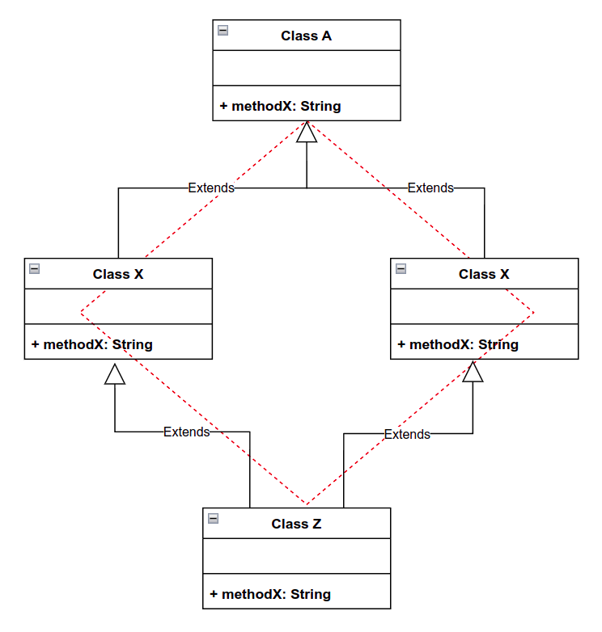

Dědičnost, method overriding, function overloading
===

Povídání
---

Dědičnost je princip v OOP, který nám dovoluje vytvořit rodičovskou třídu, od které lze oddědit společné vlastnosti a metody. Klasickým příkladem může být např. vozidlo. Každé vozidlo bude mít spotřebu, motor, maximální rychlost, bude se moci rozjet, zabrdit, natankovat, ...             
Místo toho, abychom každou z těchto vlastností a metod programovali do každé třídy, můžeme si vytvořit nějakou společnou třídu vozidlo. Každá třída odděděná od této třídy bude mít stejné vlastnosti a metody a bude si moci přidat nějaké své navíc.              

Dokonce může i přepsat metody z rodičovské třídy. Tomu se říká method overriding. Je to běžná procedura.            
Exisuje také fenomén, kterému říkáme polymorfismus. Řekněme, že vytvoříme třídu zvířátko, které bude moci udělat zvuk. Nicméně jaký zvuk dělá zvíře? No, záleží na tom, co za zvířátko to je. Takže v této třídě necháme tuto metodu prázdnou. Vlastně dokonce nemusíme ani psát tělíčko této metody, stačí nám hlavička, která může vypadat nějak takto: **void makeSound();**.            
V některých programovacích jazycík, v Javě třeba (ano, mám rád Javu, jak jste to poznali?), existuje něco, čemu se říká interface. Je to v podstatě třída, která má pouze hlavičky metod popř. vlastnosti. Každá třída, která implementuje tento interface musí nutně všechny implementovat i všechny jeho metody.              
V programovacích jazycích, jež interface nemají, Python a C++ např., existuje alespoň koncept abstraktní třídy, která funguje v podstatě obdobně, ačkoliv mají své rozdíly. Abstraktní třídy třeba mohou vytvořit nějaké metody, která mají konkrtétní implementaci. Všechny metody v interfacu musí být bez tělíčka. Abstraktní třída vás také neochrání před některými problémy dědění, které si za chvíli představíme.           
Dobře, zpět k polymorfismu. Máme tedy abstraktní třídu, ve které je pouze tělíčko metody pro udělání zvuku. Abstraktní třídu nemůžeme vytvořit samu o sobě, to by nedávalo smysl, metody v ní přece nejsou implementované. Když si teď ale vytvoříme několik tříd zvířátek, třeba gorila, pes, kočička, ... a každou z nich od abstraktní třídy oddědíme, můžeme každému zvířátku metodu předělat tak, aby udělalo svůj specifický zvuk.            
Protože jsou to všechno zvířátka, můžeme deklarovat obecné zvířátko a inicializovat ho jako konkrétní zvířátko. Když pak na tomto objektu zavoláme metodu, která dělá zvuk, uvidíme zvuk našeho zvířátka. Hezké že?             
Můžeme tedy uložit potomka do rodiče, ale pozor, nikoliv naopak!

Poslední koncept, který jsme si nezmínili, je function overloading (popř. method overloading, je to to samé). Řekněme, že máme naivní funkci sčítání v nějakém staticky typovaném jazyce. Chceme aby uměla sčítat proměnné typu int i proměnné typu float. Ale nechceme vytvářet funkce dvě. Právě k tomu slouží method overloading.            
Můžeme vytvořit dvě fce se jménem *add*. Jedna bude ale přijímat dva parametry typu int a druhá dva parametry typu float. Kompiler to rozezná jako dvě rozdílné metody. Stejným způsobem můžeme metody rozlišit podle návratového typu, počtu argumentů, ...            

Zmínil jsem, že existuje jistý problém s abstraktiní třídou, porovnáváme-li ji s interfacem. Bylo by nefér to tedy neobjasnit. V programování existuje fenomén vícenásobného dědění, tedy zkrátka a dobře jedna třída dědí od více tříd.            
Při tomto přístupu mohou nastat různorodé problémy. Co, když se metoda z obou tříd, ze kterých dědíme, jmenuje stejně? Jakou máme použít? Nebo co když obě odděděné třídy dědí od stejného rodiče? Tomu se říká problém diamantu.           
Nu, budeme v tom mít zkrátka velký guláš. Nicméně kompiler se s tím zpravidla vypřádá jednoduše. Když dědíme od více tříd, vypisujeme je postupně. No, kompiler prostě vezme tu první a řekne, tohle je tvoje implementace.             
Proč je interface o tolik lepší? No, narozdíl od jazyků jako Python a C++, Java zakazuje dědění od více než jedné třídy, čímž efektivně eliminuje tento problém. Ale nemyslete si, že nás to nějak limituje. Můžeme implementovat neomezené množství interfaců. Pamatujete? Interface nemůže obsahovat tělíčko metody, tedy ani žádnou konkrétní implementaci. Kdyby se nám náhodou nedopatřením stalo, že zdědíme stejnou metodu jako nějakou, kterou implementujeme, zkrátka se vezme zděděná implementace. Interface bude spokojený, že jeho metoda je ve třídě implementována a nám to nezpůsobí žádné problémy. Java jede ..               
Že to má i ostré cé? Myslíte Javu od Microsoftu? Asi odmítnu

Ukázky kódu
---

**Python - Inheritance**

**Java - Inheritance**

**C++ - Inheritance**

Materiály
---